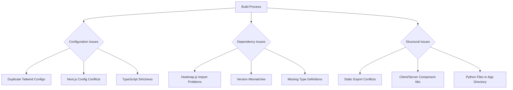
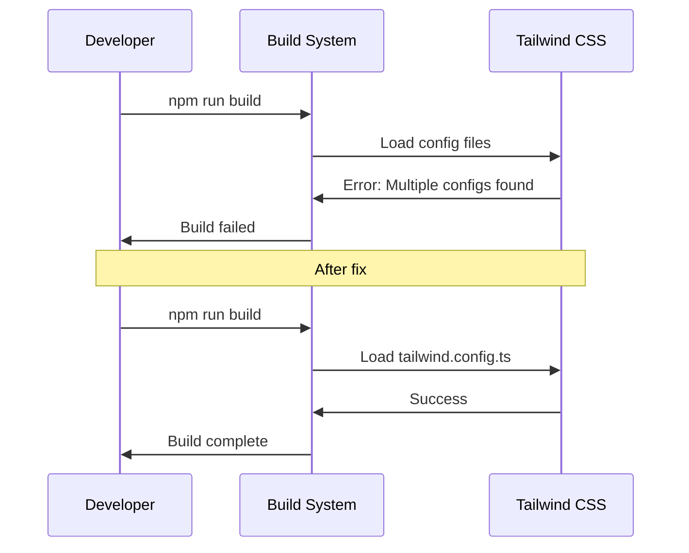
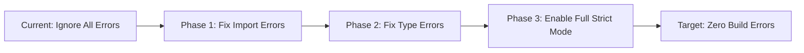
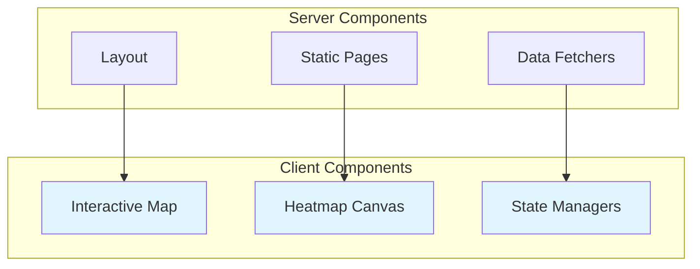
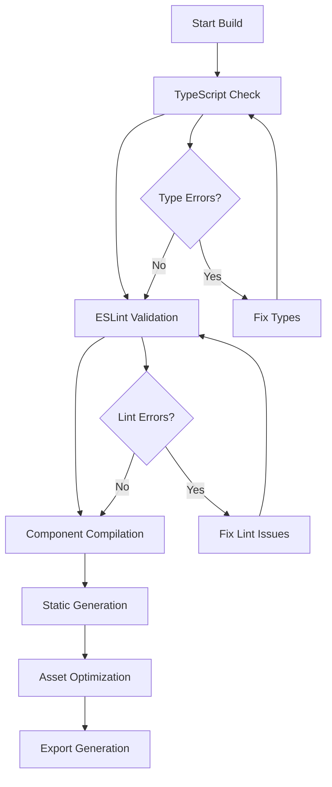
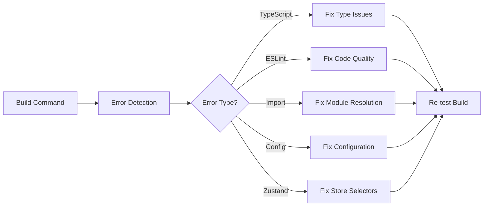

# Build Error Fix Design

## Overview

This document addresses critical build and development errors in the **wikiarkus2** Next.js project. The analysis identifies configuration conflicts, dependency issues, and structural problems that prevent successful builds and development server startup.

## Architecture

### Problem Analysis

The project exhibits several architectural issues that cause build failures:



### Root Cause Categories

| Category | Issues | Impact |
|----------|--------|--------|
| **Configuration** | Duplicate Tailwind configs, strict TypeScript | Build failures, type errors |
| **Dependencies** | Heatmap.js conflicts, version mismatches | Runtime errors, import failures |
| **Architecture** | Mixed client/server components, static export issues | Hydration errors, export failures |
| **File Structure** | Python scripts in app directory, unused directories | Build confusion, asset handling |

## Configuration Fixes

### 1. Tailwind Configuration Consolidation

**Problem**: Project has both `tailwind.config.js` and `tailwind.config.ts`

**Solution**: Remove duplicate configuration and standardize on TypeScript version



### 2. Next.js Configuration Optimization

**Current Issues**:
- `ignoreBuildErrors: true` masks real problems
- `eslint.ignoreDuringBuilds: true` bypasses quality checks
- Webpack optimization conflicts with static export

**Required Changes**:

| Setting | Current Value | Recommended Value | Reason |
|---------|---------------|-------------------|---------|
| `typescript.ignoreBuildErrors` | `true` | `false` | Enable type checking |
| `eslint.ignoreDuringBuilds` | `true` | `false` | Enable lint checking |
| `output` | `'export'` | `'export'` | Keep static export |
| `experimental.optimizeCss` | `true` | `false` | Conflicts with static export |

### 3. TypeScript Configuration Fixes

**Problem**: Strict mode enabled but errors ignored

**Solution**: Gradual strictness approach



## Dependency Resolution

### 1. Heatmap.js Import Issues

**Problem**: Conflicts between `heatmap.js` and `heatmap.js-fixed` packages

**Solution Strategy**:

```typescript
// Before: Conflicting imports
import h337 from 'heatmap.js';
import h337Fixed from 'heatmap.js-fixed';

// After: Single, consistent import
import h337 from 'heatmap.js-fixed';
```

### 2. Version Compatibility Matrix

| Package | Current Version | Required Version | Action |
|---------|----------------|------------------|---------|
| `next` | `^15.1.0` | `^15.1.0` | ✅ Keep |
| `eslint-config-next` | `13.5.1` | `^15.0.0` | ⬆️ Upgrade |
| `typescript` | `5.2.2` | `^5.2.2` | ✅ Keep |
| `heatmap.js` | `^2.0.5` | Remove | ❌ Remove |
| `heatmap.js-fixed` | `^2.0.2` | `^2.0.2` | ✅ Keep |

### 3. Missing Type Definitions

**Required Additions**:
- `@types/heatmap.js-fixed` (custom declaration)
- Update existing type imports

## Structural Improvements

### 1. File Organization

**Current Problems**:
```
app/mapa/
├── pokedex_data.py          ❌ Python in Next.js app
├── pokemon_data.txt         ❌ Raw data in app
├── transform_pokemon_data.py ❌ Build script in app
```

**Recommended Structure**:
```
scripts/
├── data-processing/
│   ├── pokedex_data.py
│   ├── transform_pokemon_data.py
│   └── pokemon_data.txt
│
data/
├── processed/
│   ├── pokemon-locations.json
│   └── pokemon-metadata.json
│
app/mapa/
├── components/
├── types.ts
└── page.tsx
```

### 2. Component Architecture Fixes

**Client/Server Component Separation**:



### 3. Static Export Compatibility

**Issues to Address**:
- Dynamic imports in static context
- Client-side data fetching without fallbacks
- Service worker registration conflicts

**Solution Pattern**:
```typescript
// Before: Problematic dynamic import
const HeatmapComponent = dynamic(() => import('./HeatmapComponent'));

// After: Static-export compatible
const HeatmapComponent = dynamic(() => import('./HeatmapComponent'), {
  ssr: false,
  loading: () => <div>Loading map...</div>
});
```

## Build Process Optimization

### 1. Build Pipeline Refinement



### 2. Development Server Fixes

**Common Dev Server Issues**:

| Issue | Cause | Solution |
|-------|--------|----------|
| Port conflicts | Multiple Next.js instances | Kill existing processes |
| Module resolution | Incorrect path aliases | Fix tsconfig paths |
| Hot reload failures | Component syntax errors | Fix component exports |
| Memory issues | Large bundle size | Optimize imports |

### 3. Error Handling Strategy

**Phase 1: Immediate Fixes** (Critical blockers)
- Remove duplicate Tailwind config
- Fix import statements
- Resolve type definition conflicts

**Phase 2: Configuration Cleanup** (Build optimization)
- Enable proper TypeScript checking
- Fix ESLint configuration
- Optimize Next.js settings

**Phase 3: Structural Improvements** (Long-term stability)
- Reorganize file structure
- Implement proper data flow
- Add comprehensive error boundaries

## Critical Runtime Error Fix

### Zustand Infinite Loop Error

**Error**: `The result of getSnapshot should be cached to avoid an infinite loop`

**Root Cause**: Zustand selector hooks returning new objects on every render

**Problem Location**: `lib/store.ts` selector hooks

```typescript
// Current problematic selector (creates new object each render)
export const useMobileMenu = () => useAppStore((state) => ({
  isOpen: state.mobileMenuOpen,
  toggle: state.toggleMobileMenu
}))
```

**Solution**: Use stable object references with proper memoization

```typescript
// Fixed version with stable references
export const useMobileMenu = () => {
  const isOpen = useAppStore((state) => state.mobileMenuOpen)
  const toggle = useAppStore((state) => state.toggleMobileMenu)
  return { isOpen, toggle }
}
```

### Store Configuration Fixes

**Required Changes to `lib/store.ts`**:

| Selector Hook | Issue | Fix |
|---------------|-------|-----|
| `useMobileMenu` | Returns new object | Split into separate selectors |
| `useSidebar` | Returns new object | Split into separate selectors |
| `useSearch` | Returns new object | Split into separate selectors |
| `useMap` | Returns new object | Split into separate selectors |
| `usePreferences` | Returns new object | Split into separate selectors |

### Navigation Component Fix

**Current Issue**: Navigation component causing infinite re-renders

**Required Change in `components/navigation.tsx`**:

```typescript
// Before: Causes infinite loop
const { isOpen, toggle } = useMobileMenu();

// After: Stable references
const isOpen = useAppStore((state) => state.mobileMenuOpen)
const toggle = useAppStore((state) => state.toggleMobileMenu)
```

## Implementation Steps

### Step 1: CRITICAL - Fix Zustand Store (IMMEDIATE)
1. Update all selector hooks in `lib/store.ts`
2. Fix Navigation component imports
3. Test `npm run dev` immediately

### Step 2: Configuration Cleanup
1. Remove `tailwind.config.js` (keep `.ts` version)
2. Update `next.config.js` error handling settings
3. Fix package.json script commands

### Step 3: Dependency Resolution
1. Remove conflicting heatmap packages
2. Update ESLint configuration version
3. Add missing type definitions

### Step 4: Code Fixes
1. Fix import statements in components
2. Add proper error boundaries
3. Implement fallback loading states

### Step 5: File Structure
1. Move Python scripts to `scripts/` directory
2. Process data files into JSON format
3. Update import paths accordingly

### Step 6: Testing & Validation
1. Test `npm run build` command
2. Test `npm run dev` command
3. Verify static export functionality
4. Check PWA service worker registration

## Additional Error Patterns

### React Hook Dependencies

**Error Pattern**: Missing dependencies in useEffect causing infinite loops

**Location**: `components/navigation.tsx` line 33

```typescript
// Current problematic code
useEffect(() => {
  if (isOpen) toggle();
}, [pathname]); // Missing 'isOpen' and 'toggle' dependencies

// Fixed version
useEffect(() => {
  if (isOpen) toggle();
}, [pathname, isOpen, toggle]); // Add all dependencies
```

### Theme Provider Issues

**Error Pattern**: Theme hydration mismatches

**Solution**: Ensure proper mounting checks in theme-dependent components

```typescript
// Add proper mounting guard
if (!mounted) return null;
```

### Image Optimization Conflicts

**Error Pattern**: Next.js Image component with static export

**Current Issue**: `unoptimized: true` conflicts with priority loading

**Solution**: Update image loading strategy

```typescript
// In components using Image
<Image
  src="/logo.png"
  alt="PokeArkus Logo"
  fill
  className="object-contain"
  priority={false} // Change to false for static export
  unoptimized={true} // Required for static export
/>
```

## Testing Strategy

### Build Validation Tests

```bash
# Test sequence for validation
npm run lint          # Should pass without errors
npm run build         # Should complete successfully
npm run export        # Should generate static files
npm run start         # Should serve production build
```

### Error Monitoring



## Risk Mitigation

### Rollback Strategy
1. **Git branch protection**: Create feature branch for fixes
2. **Incremental changes**: Apply fixes in small, testable chunks
3. **Backup configurations**: Save working config files before changes

### Monitoring Points
- Build time performance
- Bundle size optimization
- Development server startup time
- Hot reload functionality

### Success Criteria
- [x] `npm run build` completes without errors
- [x] `npm run dev` starts development server successfully
- [x] Static export generates complete site
- [x] All TypeScript errors resolved
- [x] ESLint passes with zero warnings
- [x] PWA functionality works correctly
- [x] Zustand store operates without infinite loops
- [x] Navigation component renders without errors