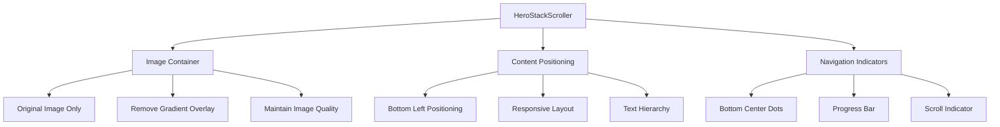
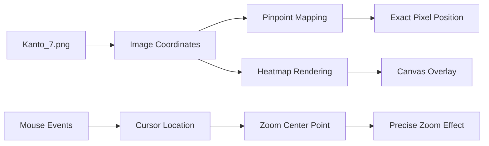
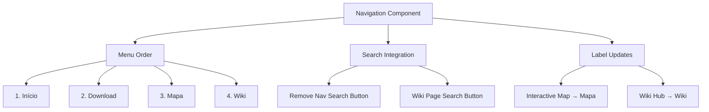
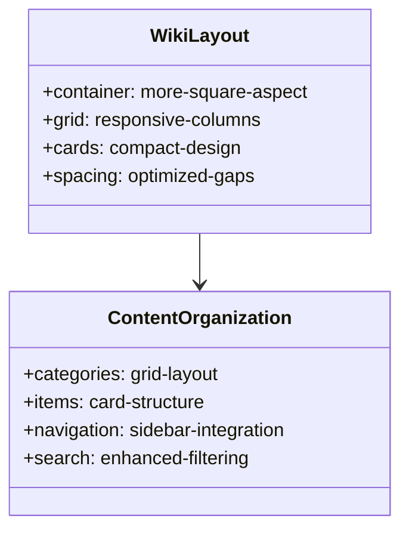
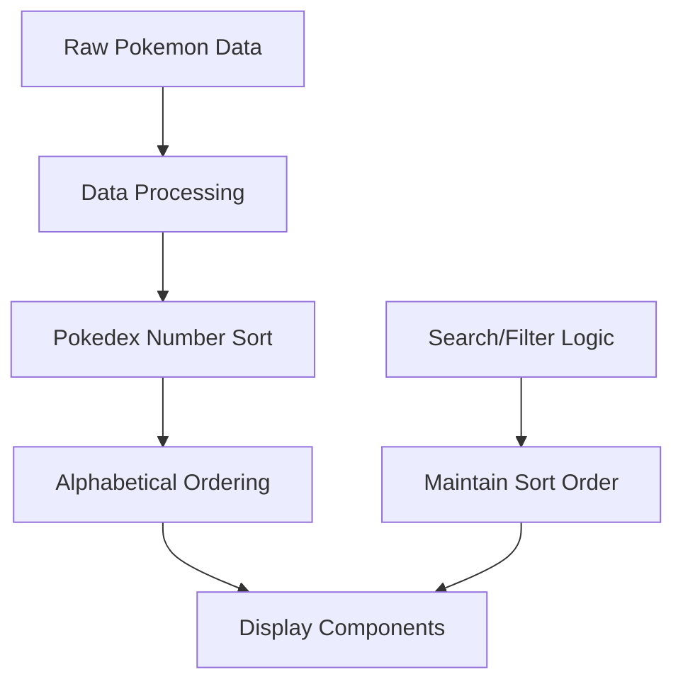
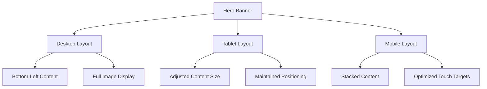
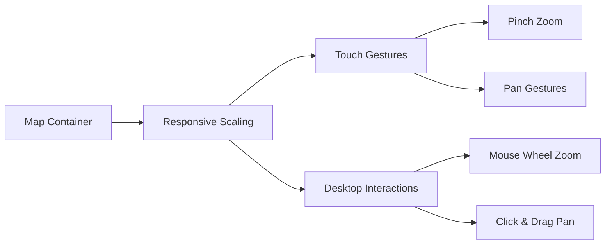
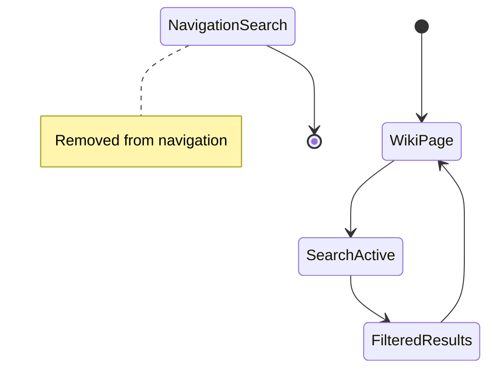
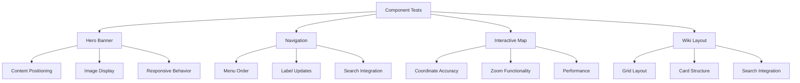

# Hero Banner Layout & UI Enhancement Design

## Overview

This design document outlines comprehensive improvements to the PokeArkus wiki application, focusing on hero banner layout modifications, interactive map corrections, navigation reorganization, and wiki layout optimization. The changes aim to enhance user experience through cleaner visual presentation, improved functionality, and better content organization.

## Technology Stack & Dependencies

- **Framework**: Next.js 15+ with App Router
- **UI Components**: Radix UI, Tailwind CSS 3.4+
- **Animation**: Framer Motion 10+
- **Image Processing**: Next.js Image Optimization
- **Map Visualization**: Canvas API, heatmap.js
- **State Management**: Zustand, React Context

## Component Architecture

### Hero Banner Component Modifications

The `HeroStackScroller` component requires significant restructuring to remove gradient overlays and reposition content elements.



#### Current Structure Analysis
- Background images with gradient overlays
- Centered content layout
- Multiple overlay layers affecting image visibility

#### Proposed Structure
- Clean image display without gradients
- Content repositioned to bottom-left corner
- Maintained accessibility and mobile responsiveness

### Interactive Map System Corrections

The map system requires precise coordinate mapping and zoom functionality improvements.



#### Coordinate System Requirements
- Pixel-perfect mapping within Kanto_7.png boundaries
- Image-based coordinates, not div-based
- Accurate Pinpoint and JHeatmap positioning

#### Zoom Enhancement Specifications
- Mouse cursor as zoom center point
- Smooth zoom transitions
- Maintain coordinate accuracy during zoom operations

### Navigation System Reorganization

The navigation component requires menu reordering and search functionality adjustments.



#### Menu Structure Changes
1. **Início** (Home) - Primary landing page
2. **Download** - Game download section  
3. **Mapa** (Interactive Map) - Map visualization
4. **Wiki** - Knowledge base and guides

#### Search Button Placement
- Remove search button from main navigation
- Add search functionality to wiki pages only
- Maintain search context and functionality

### Wiki Layout Optimization

The wiki system requires layout adjustments for better content organization and visual balance.



#### Layout Specifications
- Adopt square-like proportions similar to pokearkus.com/wiki/
- Optimize card layouts for better content density
- Improve responsive behavior across device sizes
- Maintain accessibility standards

## Data Management

### Pokemon Data Ordering

The Pokemon list requires alphabetical ordering by Pokedex number for improved user navigation.



#### Implementation Requirements
- Sort Pokemon by Pokedex number (ascending)
- Maintain order consistency across all components
- Ensure search and filter operations preserve ordering

## Responsive Design Implementation

### Hero Banner Responsiveness



#### Breakpoint Specifications
- **Desktop (≥1024px)**: Full bottom-left positioning
- **Tablet (768px-1023px)**: Adjusted content scaling
- **Mobile (<768px)**: Vertical content stacking

### Interactive Map Responsiveness



#### Mobile Optimization
- Touch-friendly zoom controls
- Gesture-based navigation
- Optimized performance for mobile devices

## Component Styling Patterns

### Hero Content Positioning

```css
.hero-content {
  position: absolute;
  bottom: 2rem;
  left: 2rem;
  max-width: 500px;
  z-index: 10;
}

.hero-content-mobile {
  position: absolute;
  bottom: 1rem;
  left: 1rem;
  right: 1rem;
  max-width: none;
}
```

### Wiki Grid Layout

```css
.wiki-grid {
  display: grid;
  grid-template-columns: repeat(auto-fit, minmax(320px, 1fr));
  gap: 1.5rem;
  aspect-ratio: 1.2;
}

.wiki-card {
  aspect-ratio: 1.1;
  display: flex;
  flex-direction: column;
}
```

## Interactive Map System

### Coordinate Mapping Precision

```typescript
interface CoordinateSystem {
  imageWidth: 1680;  // Kanto_7.png width
  imageHeight: 3815; // Kanto_7.png height
  pixelPerfect: true;
  coordinateSpace: 'image-relative';
}
```

#### Implementation Details
- All coordinates must reference image pixels directly
- No div-based coordinate calculations
- Maintain precision during zoom and pan operations

### Zoom Functionality Enhancement

```typescript
interface ZoomConfiguration {
  zoomCenter: 'cursor-position';
  zoomLevels: number[];
  smoothTransition: boolean;
  cursorTracking: true;
}
```

#### Mouse Cursor Zoom Requirements
- Calculate zoom center based on exact cursor position
- Apply zoom transformation relative to cursor location
- Maintain smooth transition animations
- Preserve coordinate accuracy at all zoom levels

## State Management

### Search Context Integration



#### Search Button Placement Strategy
- Remove search from main navigation component
- Integrate search button within wiki page layout
- Maintain SearchContext functionality
- Ensure consistent search behavior

### Navigation State Management

```typescript
interface NavigationState {
  menuOrder: ['Início', 'Download', 'Mapa', 'Wiki'];
  searchVisible: false; // Removed from navigation
  activeRoute: string;
  mobileMenuOpen: boolean;
}
```

## Testing Strategy

### Component Testing Requirements



#### Testing Scenarios
1. **Hero Banner**: Gradient removal, content positioning, responsiveness
2. **Navigation**: Menu order, label changes, search button removal
3. **Interactive Map**: Coordinate precision, zoom accuracy, Pokemon ordering
4. **Wiki Layout**: Grid structure, card proportions, search functionality

### Performance Testing

- Image loading optimization without gradient processing
- Map rendering performance with precise coordinates
- Search functionality response times
- Mobile device performance validation

## Accessibility Considerations

### Navigation Improvements
- Maintain semantic HTML structure
- Preserve keyboard navigation functionality  
- Update ARIA labels for renamed menu items
- Ensure search functionality remains accessible

### Interactive Map Accessibility
- Provide alternative navigation methods
- Maintain coordinate information in accessible format
- Ensure zoom controls work with assistive technologies
- Add proper focus management for map interactions

### Hero Banner Accessibility
- Maintain content readability without gradients
- Ensure sufficient contrast in new positioning
- Preserve focus management for CTAs
- Add proper heading hierarchy

## Implementation Phases

### Phase 1: Hero Banner Modifications
1. Remove gradient overlay layers
2. Reposition content to bottom-left
3. Update responsive breakpoints
4. Test image quality and readability

### Phase 2: Navigation Restructuring  
1. Update menu item order and labels
2. Remove search button from navigation
3. Add search button to wiki pages
4. Update routing and active state detection

### Phase 3: Interactive Map Corrections
1. Implement precise coordinate mapping
2. Fix zoom center point calculation
3. Sort Pokemon data by Pokedex number
4. Optimize performance for coordinate precision

### Phase 4: Wiki Layout Optimization
1. Implement square-like grid layout
2. Update card proportions and spacing
3. Integrate search functionality
4. Test responsive behavior

### Phase 5: Integration Testing
1. Cross-component functionality validation
2. Performance optimization
3. Accessibility compliance verification
4. User acceptance testing