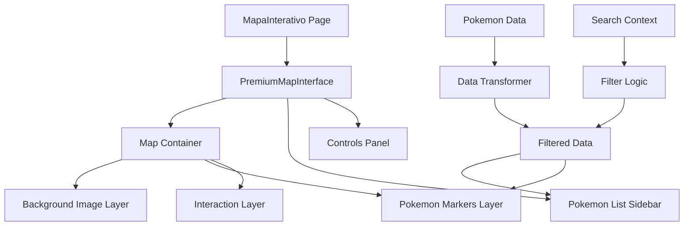

# Interactive Map & Site Fixes Design Document

## Overview

This design addresses critical issues with the Pokemon Wiki application including non-functional interactive map, broken wiki navigation, responsive design problems, navigation positioning issues, and homepage banner improvements. The fixes will restore full functionality while implementing modern responsive design patterns.

## Technology Stack & Dependencies

- **Frontend**: Next.js 15+ with App Router
- **Styling**: Tailwind CSS 3.4+ with responsive utilities
- **Animations**: Framer Motion 10+ for smooth interactions
- **State Management**: Zustand + React Context for search
- **Image Handling**: Next.js Image optimization with external API support
- **Map Implementation**: Canvas-based rendering with coordinate transformation
- **Build**: Static export compatibility with optimized bundle

## Architecture

### Interactive Map System Redesign



### Component Architecture

```mermaid
classDiagram
    class MapaInterativo {
        +viewMode : 'pinpoint' | 'heatmap'
        +searchQuery : string
        +selectedPokemon : string
        +zoom : number
        +pan : {x, y}
        +handleSearch()
        +handlePokemonSelect()
    }
    
    class PokemonListSidebar {
        +filteredPokemon : PokemonLocation[]
        +selectedPokemon : string
        +onPokemonSelect : Function
        +renderPokemonItem()
    }
    
    class MapCanvas {
        +backgroundImage : string
        +pokemonMarkers : PokemonLocation[]
        +zoom : number
        +pan : {x, y}
        +renderBackground()
        +renderMarkers()
        +handleMapInteraction()
    }
    
    MapaInterativo --> PokemonListSidebar
    MapaInterativo --> MapCanvas
```

## Data Models & Components

### Pokemon Location Interface
```typescript
interface PokemonLocation {
  id: string;
  name: string;
  dexNumber: number;
  type: string;
  rarity: 'common' | 'uncommon' | 'rare' | 'legendary';
  locations: Coordinate[];
  averageLocation: Coordinate;
}

interface Coordinate {
  x: number;
  y: number;
  z: number;
  terrain?: TerrainType;
}
```

### Map Configuration
```typescript
interface MapConfig {
  backgroundImage: string;
  dimensions: { width: number; height: number };
  maxZoom: number;
  minZoom: number;
  initialZoom: number;
  markers: {
    size: { small: number; medium: number; large: number };
    colors: Record<PokemonType, string>;
  };
}
```

## Interactive Map Implementation

### Core Features Implementation

**Map Background Integration**
- Load `public/map/Kanto_7.png` as background layer
- Implement proper image scaling and positioning
- Add zoom and pan controls with smooth animations
- Support touch gestures for mobile devices

**Pokemon Data Integration**
- Import existing Pokemon location data from `app/mapa/pokemon_data.ts`
- Transform coordinate system to match map dimensions
- Filter Pokemon based on search criteria
- Display markers with Pokemon sprites and info tooltips

**Responsive Map Container**
```jsx
const MapContainer = ({ pokemonData, searchQuery }) => {
  const [zoom, setZoom] = useState(1);
  const [pan, setPan] = useState({ x: 0, y: 0 });
  const [selectedPokemon, setSelectedPokemon] = useState(null);
  
  return (
    <div className="grid grid-cols-1 lg:grid-cols-4 gap-6 h-screen">
      {/* Pokemon List Sidebar - Right Side */}
      <div className="lg:col-span-1 lg:order-2">
        <PokemonListSidebar 
          pokemon={filteredPokemon}
          onSelect={setSelectedPokemon}
        />
      </div>
      
      {/* Map Area - Left Side */}
      <div className="lg:col-span-3 lg:order-1">
        <MapCanvas 
          backgroundImage="/map/Kanto_7.png"
          pokemonData={pokemonData}
          zoom={zoom}
          pan={pan}
          selectedPokemon={selectedPokemon}
        />
      </div>
    </div>
  );
};
```

### Removed Features
- Water/Forest/Mountain terrain filters
- Map Filters section
- Terrain-based categorization displays

### Enhanced Features
- **Pokemon List Sidebar**: Right-side panel showing filtered Pokemon with sprites and details
- **Direct Pokemon Selection**: Click on list items to highlight on map
- **Search Integration**: Real-time filtering of both map markers and list
- **Responsive Design**: Mobile-first layout with collapsible sidebar

## Wiki Hub Navigation System

### Route Structure Analysis
Current wiki routes that need proper navigation:
- `/wiki/boost` - Boost system guide
- `/wiki/brotherhood` - Brotherhood mechanics
- `/wiki/raids` - Raid strategies
- `/wiki/quests` - Quest walkthroughs
- `/wiki/clans` - Clan information
- `/wiki/helds` - Held items guide

### Wiki Hub Component Redesign

```jsx
const WikiHub = () => {
  const wikiCategories = [
    {
      title: "Game Mechanics",
      description: "Core gameplay systems",
      items: [
        { name: "Boost System", href: "/wiki/boost", icon: "⚡" },
        { name: "Capture System", href: "/wiki/sistema-de-captura", icon: "⚪" },
        { name: "Tasks & Goals", href: "/wiki/tasks", icon: "📋" }
      ]
    },
    {
      title: "Social Features", 
      description: "Community and multiplayer",
      items: [
        { name: "Brotherhood", href: "/wiki/brotherhood", icon: "🤝" },
        { name: "Clans", href: "/wiki/clans", icon: "⚔️" },
        { name: "Raids", href: "/wiki/raids", icon: "👥" }
      ]
    },
    {
      title: "Items & Equipment",
      description: "Gear and enhancement items", 
      items: [
        { name: "Held Items", href: "/wiki/helds", icon: "🎒" },
        { name: "Charms", href: "/wiki/charms", icon: "✨" },
        { name: "Relics", href: "/wiki/reliquias", icon: "🏺" }
      ]
    }
  ];

  return (
    <div className="grid grid-cols-1 md:grid-cols-2 lg:grid-cols-3 gap-8">
      {wikiCategories.map((category, index) => (
        <CategoryCard key={index} category={category} />
      ))}
    </div>
  );
};
```

### Navigation Breadcrumbs
```jsx
const WikiBreadcrumb = ({ currentPath }) => {
  const pathSegments = currentPath.split('/').filter(Boolean);
  
  return (
    <nav className="flex items-center space-x-2 mb-6">
      <Link href="/wiki" className="text-primary hover:underline">
        Wiki Hub
      </Link>
      {pathSegments.slice(1).map((segment, index) => (
        <Fragment key={index}>
          <ChevronRight className="h-4 w-4 text-muted-foreground" />
          <span className="text-muted-foreground capitalize">
            {segment.replace('-', ' ')}
          </span>
        </Fragment>
      ))}
    </nav>
  );
};
```

## Navigation & Layout Fixes

### Centered Navigation Layout

Current Issue: Logo centered, menu items not properly aligned

**Fixed Navigation Structure**
```jsx
const Navigation = () => {
  return (
    <nav className="fixed top-4 left-1/2 -translate-x-1/2 z-50 w-[95%] max-w-6xl">
      <div className="flex h-16 items-center justify-between px-6">
        {/* Logo - Left Aligned */}
        <div className="flex items-center">
          <Logo />
        </div>
        
        {/* Menu Items - Center */}
        <div className="hidden md:flex items-center justify-center flex-1">
          <div className="flex items-center space-x-8">
            {menuItems.map(item => (
              <NavLink key={item.href} {...item} />
            ))}
          </div>
        </div>
        
        {/* Actions - Right Aligned */}
        <div className="flex items-center space-x-3">
          <SearchButton />
          <ThemeToggle />
          <MobileMenuToggle />
        </div>
      </div>
    </nav>
  );
};
```

### Responsive Navigation Improvements

**Mobile Navigation Enhancements**
- Full-screen overlay menu for mobile devices
- Touch-friendly navigation with proper spacing
- Smooth animations and transitions
- Proper focus management for accessibility

**Tablet Optimizations**
- Collapsible menu at medium breakpoints
- Optimized touch targets
- Proper spacing for finger navigation

## Responsive Design System

### Breakpoint Strategy
```css
/* Mobile First Approach */
.container {
  @apply w-full px-4;
}

/* Tablet */
@media (min-width: 768px) {
  .container {
    @apply px-6;
  }
}

/* Desktop */
@media (min-width: 1024px) {
  .container {
    @apply px-8 max-w-7xl mx-auto;
  }
}

/* Large Desktop */
@media (min-width: 1280px) {
  .container {
    @apply px-12;
  }
}
```

### Component Responsive Patterns

**Interactive Map Responsive Layout**
```jsx
const ResponsiveMapLayout = () => {
  return (
    <div className="flex flex-col lg:flex-row gap-6 h-screen">
      {/* Mobile: Sidebar on top, Map below */}
      <div className="order-1 lg:order-2 lg:w-1/4">
        <PokemonSidebar />
      </div>
      
      {/* Mobile: Map takes remaining space */}
      <div className="order-2 lg:order-1 lg:w-3/4 min-h-[400px] lg:min-h-0">
        <MapCanvas />
      </div>
    </div>
  );
};
```

**Wiki Grid Responsive Layout**
```jsx
const WikiGrid = () => {
  return (
    <div className="grid grid-cols-1 sm:grid-cols-2 lg:grid-cols-3 xl:grid-cols-4 gap-4 md:gap-6">
      {categories.map(category => (
        <WikiCard key={category.id} {...category} />
      ))}
    </div>
  );
};
```

## Homepage Banner Implementation

### Stack Scroller Design

**Banner Configuration**
```javascript
const banners = [
  {
    image: '/banners/POKEARKUS.jpg',
    title: 'Welcome to PokeArkus',
    description: 'The ultimate Pokemon gaming experience',
    cta: 'Explore Now'
  },
  {
    image: '/banners/GOAL_SITE.jpg', 
    title: 'Set Your Goals',
    description: 'Track progress and achieve milestones',
    cta: 'View Goals'
  },
  {
    image: '/banners/LICH.jpg',
    title: 'Face the Lich',
    description: 'Challenge the ultimate boss',
    cta: 'Learn More'
  }
];
```

**Hero Stack Scroller Component**
```jsx
const HeroStackScroller = ({ banners }) => {
  const [currentIndex, setCurrentIndex] = useState(0);
  
  return (
    <div className="relative h-screen overflow-hidden">
      <AnimatePresence mode="wait">
        {banners.map((banner, index) => (
          <motion.div
            key={index}
            initial={{ opacity: 0, scale: 1.1 }}
            animate={{ 
              opacity: index === currentIndex ? 1 : 0,
              scale: index === currentIndex ? 1 : 1.1 
            }}
            exit={{ opacity: 0, scale: 0.95 }}
            transition={{ duration: 0.8, ease: "easeInOut" }}
            className="absolute inset-0"
          >
            <BannerSlide banner={banner} />
          </motion.div>
        ))}
      </AnimatePresence>
      
      <ScrollIndicator 
        current={currentIndex}
        total={banners.length}
        onChange={setCurrentIndex}
      />
    </div>
  );
};
```

### Banner Layout Specifications

**qoder.com-inspired Design**
- Full-viewport height banners
- Parallax scrolling effects
- Smooth transitions between slides
- Interactive scroll indicators
- Responsive image optimization
- Progressive loading with blur placeholders

**Content Overlay Structure**
```jsx
const BannerSlide = ({ banner }) => {
  return (
    <div className="relative h-full w-full">
      {/* Background Image */}
      <Image
        src={banner.image}
        alt={banner.title}
        fill
        className="object-cover"
        priority
      />
      
      {/* Overlay Gradient */}
      <div className="absolute inset-0 bg-gradient-to-r from-black/60 to-transparent" />
      
      {/* Content */}
      <div className="absolute inset-0 flex items-center">
        <div className="container mx-auto px-6">
          <motion.div
            initial={{ opacity: 0, x: -50 }}
            animate={{ opacity: 1, x: 0 }}
            transition={{ delay: 0.3 }}
            className="max-w-2xl"
          >
            <h1 className="text-4xl md:text-6xl font-bold text-white mb-6">
              {banner.title}
            </h1>
            <p className="text-xl text-gray-200 mb-8">
              {banner.description}
            </p>
            <Button size="lg" className="text-lg px-8 py-3">
              {banner.cta}
            </Button>
          </motion.div>
        </div>
      </div>
    </div>
  );
};
```

## Download Section Redesign

### qoder.com-style Download Interface

**Download Component Structure**
```jsx
const DownloadSection = () => {
  return (
    <section className="py-24 bg-gradient-to-br from-primary/5 to-purple-500/5">
      <div className="container mx-auto px-6">
        <div className="max-w-4xl mx-auto text-center">
          {/* Header */}
          <motion.div
            initial={{ opacity: 0, y: 20 }}
            animate={{ opacity: 1, y: 0 }}
            className="mb-16"
          >
            <h2 className="text-4xl md:text-5xl font-bold mb-6">
              Start Your Pokemon Journey
            </h2>
            <p className="text-xl text-muted-foreground max-w-2xl mx-auto">
              Download PokeArkus and explore the ultimate Pokemon gaming experience with interactive maps, comprehensive guides, and community features.
            </p>
          </motion.div>
          
          {/* Download Options */}
          <div className="grid md:grid-cols-2 gap-8 mb-12">
            <DownloadCard 
              platform="Windows"
              icon={<Windows className="h-8 w-8" />}
              version="v2.1.0"
              size="245 MB"
              downloadUrl="/downloads/pokearkus-windows.exe"
            />
            <DownloadCard 
              platform="macOS" 
              icon={<Apple className="h-8 w-8" />}
              version="v2.1.0"
              size="198 MB"
              downloadUrl="/downloads/pokearkus-macos.dmg"
            />
          </div>
          
          {/* Features Preview */}
          <FeaturePreview />
        </div>
      </div>
    </section>
  );
};
```

### Download Card Component
```jsx
const DownloadCard = ({ platform, icon, version, size, downloadUrl }) => {
  return (
    <motion.div
      whileHover={{ scale: 1.02, y: -5 }}
      className="glass-card p-8 text-center"
    >
      <div className="text-primary mb-4">{icon}</div>
      <h3 className="text-2xl font-bold mb-2">{platform}</h3>
      <div className="text-muted-foreground mb-6">
        <p>Version {version}</p>
        <p>{size}</p>
      </div>
      <Button 
        size="lg" 
        className="w-full"
        onClick={() => window.open(downloadUrl)}
      >
        <Download className="h-5 w-5 mr-2" />
        Download for {platform}
      </Button>
    </motion.div>
  );
};
```

## Build Configuration Fixes

### Next.js Configuration Updates

**next.config.js Optimization**
```javascript
/** @type {import('next').NextConfig} */
const nextConfig = {
  output: 'export',
  trailingSlash: true,
  images: {
    unoptimized: true,
    domains: ['raw.githubusercontent.com']
  },
  webpack: (config, { dev }) => {
    if (!dev) {
      config.optimization.usedExports = true;
      config.optimization.splitChunks = {
        chunks: 'all',
        cacheGroups: {
          vendor: {
            test: /[\\/]node_modules[\\/]/,
            name: 'vendors',
            chunks: 'all',
          },
        },
      };
    }
    return config;
  },
  experimental: {
    optimizeCss: true,
  }
};

module.exports = nextConfig;
```

### Package.json Script Updates
```json
{
  "scripts": {
    "dev": "next dev",
    "build": "next build",
    "export": "next export",
    "start": "next start",
    "lint": "next lint",
    "build:static": "npm run build && npm run export"
  }
}
```

### Build Optimization Strategy

**Static Export Compatibility**
- Remove server-side only features
- Optimize images for static hosting
- Implement proper asset paths
- Bundle splitting for optimal loading
- CSS optimization and minification

**Performance Enhancements**
- Lazy loading for heavy components
- Image optimization with Next.js Image
- Code splitting by route
- Progressive loading strategies
- Caching strategies for static assets

## Testing Strategy

### Component Testing
```javascript
// Map Component Tests
describe('Interactive Map', () => {
  test('loads background image correctly', () => {
    render(<MapCanvas backgroundImage="/map/Kanto_7.png" />);
    expect(screen.getByAltText('Kanto Map')).toBeInTheDocument();
  });
  
  test('filters Pokemon based on search', () => {
    render(<MapInterface searchQuery="pikachu" />);
    expect(screen.getByText('Pikachu')).toBeInTheDocument();
  });
  
  test('responds to zoom controls', () => {
    render(<MapInterface />);
    fireEvent.click(screen.getByLabelText('Zoom In'));
    // Test zoom level change
  });
});
```

### Responsive Testing
```javascript
describe('Responsive Design', () => {
  test('adapts to mobile viewport', () => {
    global.innerWidth = 375;
    render(<Navigation />);
    expect(screen.getByLabelText('Mobile Menu')).toBeInTheDocument();
  });
  
  test('shows desktop layout on large screens', () => {
    global.innerWidth = 1024;
    render(<Navigation />);
    expect(screen.getByText('Interactive Map')).toBeVisible();
  });
});
```

### Integration Testing
- Wiki navigation flow testing
- Search functionality across components
- Map interaction and data loading
- Mobile touch gesture support
- Theme switching functionality

## Implementation Phases

### Phase 1: Core Map Functionality
1. Implement map background loading
2. Integrate Pokemon data display
3. Add basic zoom/pan controls
4. Create Pokemon list sidebar

### Phase 2: Navigation & Wiki Fixes  
1. Fix navigation layout and centering
2. Implement wiki hub with proper routing
3. Add breadcrumb navigation
4. Mobile navigation improvements

### Phase 3: Responsive Design
1. Mobile-first layout implementation
2. Tablet optimization
3. Touch gesture support
4. Component responsive patterns

### Phase 4: Homepage & Download
1. Hero banner stack scroller
2. Download section redesign  
3. qoder.com-style layouts
4. Performance optimization

### Phase 5: Build & Deployment
1. Fix build configuration
2. Static export optimization
3. Performance testing
4. Production deployment