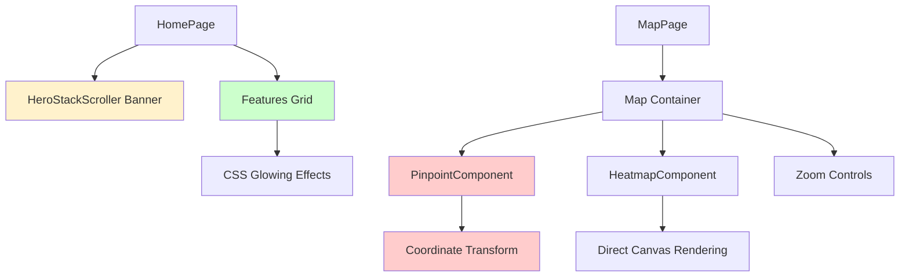

# Map UI Fixes Design Document

## Overview
This design document outlines the necessary fixes and improvements for the interactive map system and homepage UI components in the PokeArkus2 project. The main focus is on correcting positioning issues in the PinpointComponent, optimizing zoom behavior, adjusting banner size, and adding interactive glowing effects to the homepage menu.

## Current Issues Analysis

### 1. PinpointComponent Positioning Problem
The PinpointComponent has incorrect coordinate positioning compared to the HeatmapComponent. While HeatmapComponent uses direct pixel coordinates (`loc.x`, `loc.y`) from the image, PinpointComponent applies unnecessary transformations that misalign the pins.

### 2. Map Zoom and Centering Issues
- Map starts at 0.5x zoom instead of 100% (1.0x)
- Initial pan position doesn't center the map properly
- Cursor-based zoom calculations have bugs in coordinate transformation

### 3. Banner Size Issue
The HeroStackScroller component takes full screen height (`h-screen`), making it too large for the homepage layout.

### 4. Missing Interactive Effects
The homepage features grid lacks reactive mouse-based glowing effects that would enhance user engagement.

## Architecture



## Component Fixes Design

### 1. PinpointComponent Coordinate Fix

**Current Issue Analysis:**
- HeatmapComponent correctly uses `loc.x` and `loc.y` directly as canvas coordinates
- PinpointComponent applies incorrect viewport transformations and scaling

**Solution Design:**
```typescript
// Remove complex viewport coordinate transformations
// Use direct positioning like HeatmapComponent
style={{
  left: `${loc.x}px`,  // Direct pixel positioning
  top: `${loc.y}px`,   // Direct pixel positioning
  // Remove transform calculations that misalign pins
}}
```

**Key Changes:**
- Simplify coordinate positioning to match HeatmapComponent approach
- Remove unnecessary viewport bound calculations
- Keep viewport culling for performance but fix coordinate system
- Maintain transform scaling only for visual pin size, not positioning

### 2. Map Zoom and Centering Improvements

**Initial Zoom and Pan Configuration:**
```typescript
const [zoom, setZoom] = useState(1.0); // 100% instead of 0.5
const [pan, setPan] = useState({ x: 0, y: -500 }); // Center on top area
```

**Cursor-Based Zoom Fix:**
```typescript
const handleWheel = useCallback((e: React.WheelEvent) => {
  e.preventDefault();
  const delta = e.deltaY;
  const zoomFactor = 1.1;
  
  const rect = containerRef.current?.getBoundingClientRect();
  if (!rect) return;
  
  // Fix: Get mouse position relative to container
  const mouseX = e.clientX - rect.left;
  const mouseY = e.clientY - rect.top;
  
  // Fix: Convert to map coordinates before zoom
  const mapX = (mouseX - pan.x) / zoom;
  const mapY = (mouseY - pan.y) / zoom;
  
  const newZoom = delta < 0 
    ? Math.min(zoom * zoomFactor, 3)
    : Math.max(zoom / zoomFactor, 0.1);
  
  // Fix: Recalculate pan to keep mouse position fixed
  const newPanX = mouseX - mapX * newZoom;
  const newPanY = mouseY - mapY * newZoom;
  
  setZoom(newZoom);
  setPan({ x: newPanX, y: newPanY });
}, [zoom, pan]);
```

### 3. Banner Size Reduction

**Current Structure:**
```typescript
<div className="relative h-screen overflow-hidden">
```

**New Structure:**
```typescript
<div className="relative h-[70vh] lg:h-[80vh] overflow-hidden">
```

**Responsive Design:**
- Mobile: 70% viewport height
- Desktop: 80% viewport height
- Maintains aspect ratio while reducing overall size

### 4. CSS-Based Glowing Warp Effect

**Implementation Strategy:**
```css
.feature-card {
  position: relative;
  overflow: hidden;
}

.feature-card::before {
  content: '';
  position: absolute;
  top: -50%;
  left: -50%;
  width: 200%;
  height: 200%;
  background: radial-gradient(
    circle at var(--mouse-x, 50%) var(--mouse-y, 50%), 
    rgba(var(--primary-rgb), 0.15) 0%, 
    transparent 50%
  );
  opacity: 0;
  transition: opacity 0.3s ease;
  pointer-events: none;
}

.feature-card:hover::before {
  opacity: 1;
}
```

**JavaScript Integration:**
```typescript
const handleMouseMove = (e: React.MouseEvent<HTMLDivElement>) => {
  const rect = e.currentTarget.getBoundingClientRect();
  const x = ((e.clientX - rect.left) / rect.width) * 100;
  const y = ((e.clientY - rect.top) / rect.height) * 100;
  
  e.currentTarget.style.setProperty('--mouse-x', `${x}%`);
  e.currentTarget.style.setProperty('--mouse-y', `${y}%`);
};
```

## Implementation Changes

### 1. PinpointComponent Modifications

```typescript
// Simplify positioning to match HeatmapComponent approach
<div
  key={`${pokemon.name}-${index}`}
  className="absolute feature-card"
  style={{
    left: `${loc.x}px`,    // Direct positioning like HeatmapComponent
    top: `${loc.y}px`,     // Direct positioning like HeatmapComponent
    zIndex: 20
  }}
>
```

### 2. Map Container Initial State

```typescript
// Update initial zoom to 100% and center on top
const [zoom, setZoom] = useState(1.0);
const [pan, setPan] = useState({ x: 0, y: -500 });
```

### 3. HeroStackScroller Height Adjustment

```typescript
<div className="relative h-[70vh] lg:h-[80vh] overflow-hidden">
```

### 4. Features Grid Enhancement

```typescript
<motion.div
  onMouseMove={handleMouseMove}
  whileHover={{ scale: 1.02, y: -5 }}
  className="group feature-card"
>
  <Card className="h-full cursor-pointer transition-all duration-300 hover:shadow-xl border-2 hover:border-primary/20 glow-effect">
```

## CSS Enhancements

### Glowing Effect Styles
```css
.glow-effect {
  position: relative;
  overflow: hidden;
}

.glow-effect::before {
  content: '';
  position: absolute;
  top: -2px;
  left: -2px;
  right: -2px;
  bottom: -2px;
  background: linear-gradient(
    45deg,
    transparent,
    rgba(var(--primary-rgb), 0.4),
    transparent
  );
  z-index: -1;
  border-radius: inherit;
  opacity: 0;
  transition: opacity 0.3s ease;
}

.glow-effect:hover::before {
  opacity: 1;
  animation: glow-rotate 2s linear infinite;
}

@keyframes glow-rotate {
  0% { transform: rotate(0deg); }
  100% { transform: rotate(360deg); }
}

.feature-card::after {
  content: '';
  position: absolute;
  inset: 0;
  background: radial-gradient(
    600px circle at var(--mouse-x, 50%) var(--mouse-y, 50%),
    rgba(255, 255, 255, 0.1) 0%,
    transparent 40%
  );
  opacity: 0;
  transition: opacity 0.3s ease;
  pointer-events: none;
}

.feature-card:hover::after {
  opacity: 1;
}
```

## Testing Strategy

### 1. Position Accuracy Testing
- Verify PinpointComponent markers align with HeatmapComponent heat points
- Test across different zoom levels and pan positions
- Compare coordinate accuracy between both visualization modes

### 2. Zoom Behavior Testing
- Test cursor-centered zoom functionality
- Verify initial zoom level is 100% and properly centered
- Test zoom limits (0.1x to 3.0x)
- Verify smooth zoom transitions

### 3. Responsive Design Testing
- Test banner size on different screen resolutions
- Verify glowing effects work across devices
- Test mouse interaction responsiveness

### 4. Performance Testing
- Monitor rendering performance with glowing effects
- Test map interaction smoothness with fixes
- Verify memory usage remains stable

## Performance Considerations

### 1. CSS Optimization
- Use `transform` and `opacity` for animations (GPU accelerated)
- Implement `will-change` property for hover effects
- Use CSS custom properties for dynamic values

### 2. Component Memoization
- Maintain existing `memo()` wrapping for components
- Use `useCallback` for mouse event handlers
- Implement debouncing for frequent mouse movements

### 3. Rendering Optimization
- Keep viewport culling for PinpointComponent
- Use `requestAnimationFrame` for smooth animations
- Minimize DOM updates during interactions