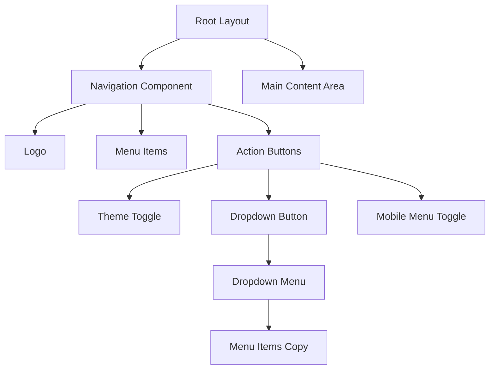

# Page Margin Adjustment and Navigation Improvements

## Overview

This document outlines the design for implementing three key UI improvements:
1. Adding a 260px top margin to all pages to create spacing
2. Limiting the black navigation bar highlight to only span from the logo to the theme button
3. Implementing the dropdown functionality for the navigation menu

## Current Implementation Analysis

### Navigation Component Structure
The navigation component (`components/navigation.tsx`) currently features:
- A fixed top navigation bar with logo on the left, menu items in the center, and actions (theme toggle, mobile menu) on the right
- A scroll effect that changes the navbar background from transparent to a semi-transparent black
- Mobile menu implementation with slide-in overlay
- Theme toggle functionality

### Layout Structure
The main layout (`app/layout.tsx`) uses a flex column structure with:
- Navigation component at the top
- Main content area taking remaining space
- Fixed height spacer div (24px) after navigation

## Design Changes

### 1. Page Margin Adjustment

#### Current State
Pages currently start immediately after the navigation spacer (24px).

#### Proposed Solution
Add a 260px top margin to all pages to create the desired spacing.

#### Implementation Approach
- Modify the main layout to add a 260px top padding to the main content area
- Ensure this spacing works responsively across all device sizes

### 2. Navigation Bar Highlight Limitation

#### Current State
The navigation bar highlight (black background) spans the full width of the page when scrolled.

#### Proposed Solution
Limit the highlight to only span from the logo to the theme toggle button.

#### Implementation Approach
- Modify the navigation component to change the background application
- Apply the background highlight only to the navigation container, not the full-width bar

### 3. Navigation Dropdown Implementation

#### Current State
The navigation dropdown button exists but has no functionality - clicking does nothing.

#### Proposed Solution
Implement a functional dropdown menu that appears when the dropdown button is clicked, showing the same menu items as the main navigation.

#### Implementation Approach
- Add state management for the dropdown visibility
- Create dropdown menu component with the same menu items
- Position the dropdown below the navigation bar
- Implement proper show/hide functionality with animations

## System Architecture

### Component Structure

### State Management

| Component | State | Purpose |
|-----------|-------|---------|
| Navigation | scrolled | Controls navbar background on scroll |
| Navigation | dropdownOpen | Controls dropdown menu visibility |
| Navigation | isOpen | Controls mobile menu visibility |

### Styling Approach

The styling modifications will focus on adjusting the layout and visual presentation:

1. **Content Spacing**: Increase the top margin of the main content area to create the required 260px breathing space
2. **Navigation Highlight Scope**: Restrict the background highlight effect to only the navigation container rather than the full-width bar
3. **Dropdown Positioning**: Position the dropdown menu to appear directly below the navigation bar

## UI/UX Design

### Spacing System

| Element | Size | Purpose |
|--------|------|---------|
| Top Page Margin | 260px | Create visual breathing room |
| Navigation Height | 64px (h-16) | Standard navigation height |
| Navigation Top Offset | 16px (top-4) | Create floating effect |

### Interaction Flow

#### Dropdown Menu
1. User clicks dropdown button
2. State changes: dropdownOpen = true
3. Dropdown menu animates into view
4. User can click menu items to navigate
5. Dropdown closes on item selection or outside click

#### Scroll Effect
1. User scrolls down the page
2. At 20px scroll position, state changes: scrolled = true
3. Navigation background changes from transparent to black/80
4. Box shadow and backdrop blur are applied

## Responsive Design Considerations

### Breakpoint Strategy
- Mobile: < 768px (md)
- Tablet: 768px - 1024px
- Desktop: > 1024px

### Mobile Adaptations
- Dropdown functionality disabled on mobile (uses existing hamburger menu)
- Top margin reduced on smaller screens for better usability
- Navigation container width adjusted for screen size

## Accessibility Requirements

### Keyboard Navigation
- Dropdown menu accessible via Tab key
- Arrow keys navigate between menu items
- Enter/Space selects menu items
- Escape key closes dropdown

### Screen Reader Support
- Proper ARIA attributes for dropdown state
- Descriptive labels for all interactive elements
- Focus management when opening/closing dropdown

## Performance Considerations

### Animation Performance
- Use hardware-accelerated CSS properties (transform, opacity)
- Limit expensive operations during scroll events
- Debounce scroll handlers for better performance

### Bundle Size Impact
- Utilize existing component library (shadcn/ui)
- No additional dependencies required
- Minimal JavaScript overhead

## Testing Strategy

### Visual Regression Tests
| Component | Properties | Expected Outcome |
|-----------|------------|------------------|
| Page Margin | All pages | 260px top spacing visible |
| Navigation Highlight | Scrolled state | Background limited to container |
| Dropdown Menu | Click action | Menu appears below button |

### Functional Tests
| Interaction | Steps | Expected Result |
|------------|-------|----------------|
| Dropdown Toggle | Click dropdown button | Menu opens/closes |
| Menu Navigation | Click dropdown item | Navigation occurs, menu closes |
| Scroll Effect | Scroll 20px down | Background changes |

### Cross-browser Compatibility
- Chrome (latest)
- Firefox (latest)
- Safari (latest)
- Edge (latest)
- Mobile Safari
- Chrome Mobile

## Implementation Roadmap

### Phase 1: Layout Adjustment
1. Modify main layout component
2. Add responsive top padding
3. Test across screen sizes

### Phase 2: Navigation Refinement
1. Update navigation component structure
2. Limit background highlight scope
3. Verify scroll effect still works

### Phase 3: Dropdown Implementation
1. Add dropdown state management
2. Implement dropdown menu component
3. Add interaction handlers
4. Test keyboard accessibility

### Phase 4: Validation
1. Cross-browser testing
2. Accessibility audit
3. Performance benchmarking
4. User acceptance testing