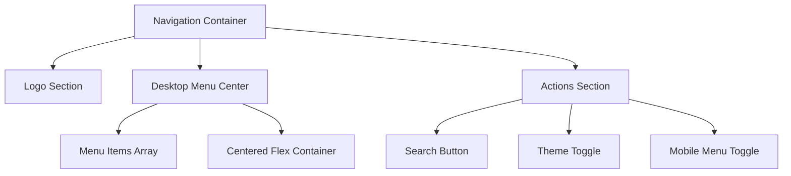
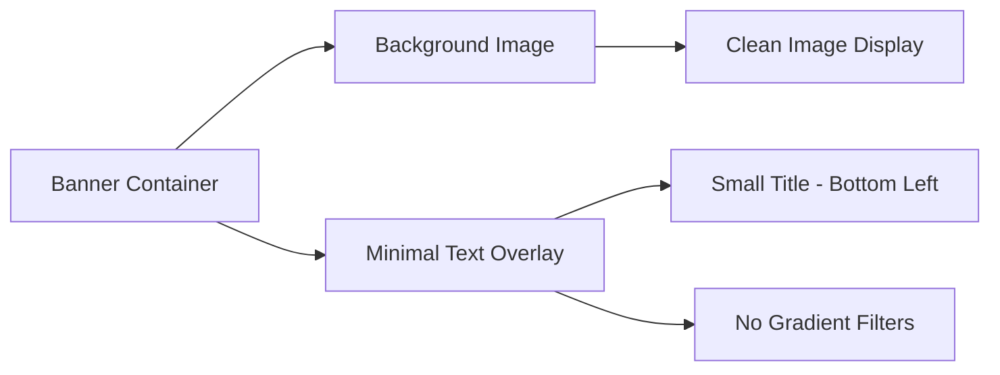
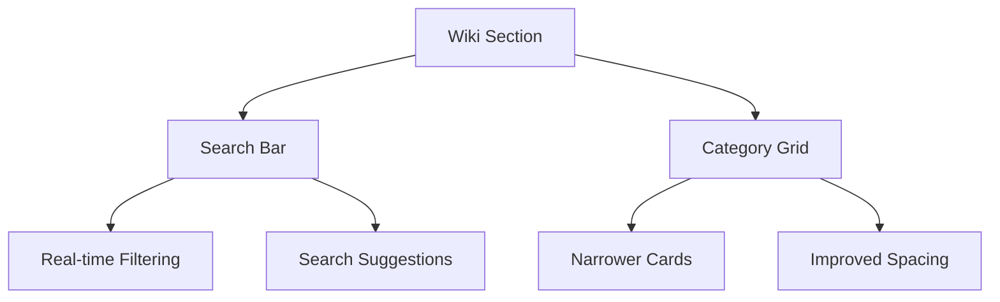
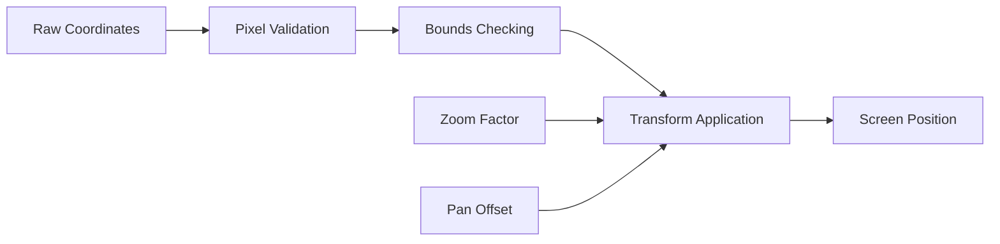
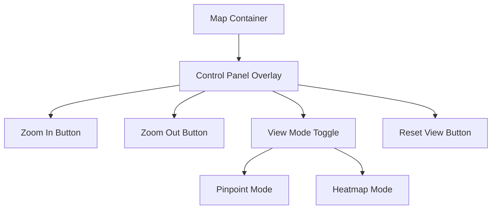
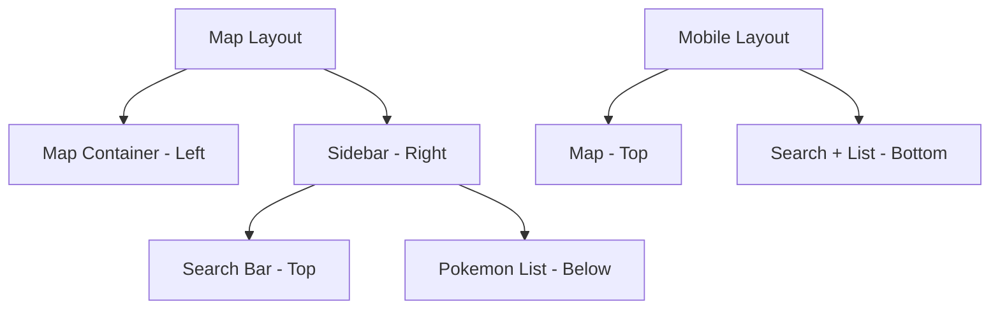
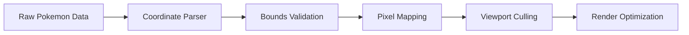
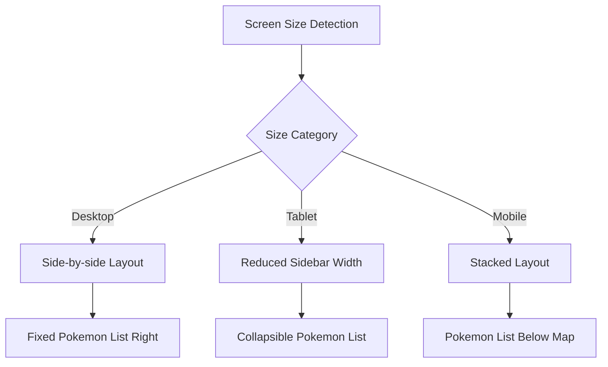

# Pokemon Map Enhancements Design Document

## Overview

This design document outlines comprehensive enhancements to the Pokemon mapping interface and overall application user experience. The improvements focus on navigation centering, responsive design fixes, banner optimization, interactive map functionality upgrades, and UI/UX refinements.

## Technology Stack & Dependencies

- **Framework**: Next.js 15+ with App Router
- **Language**: TypeScript 5+
- **Styling**: Tailwind CSS 3.4+ with responsive utilities
- **Animation**: Framer Motion 10+ with performance optimizations
- **UI Components**: Radix UI Primitives with custom styling
- **Map Visualization**: Canvas-based rendering with pixel-perfect coordinate mapping
- **State Management**: React Context API and local component state

## Component Architecture

### Navigation System Enhancement

#### Current Issue Analysis
The navigation menu currently has only the logo centered, while the menu items remain left-aligned despite using flexbox centering classes.

#### Navigation Component Structure


#### Navigation Layout Architecture
- **Container Layout**: Fixed positioning with centered transform
- **Flex Distribution**: Three-column layout (Logo | Menu | Actions)
- **Menu Centering**: Dedicated center section with proper flex-1 spacing
- **Responsive Behavior**: Mobile-first approach with lg breakpoints

### Responsive Design Fixes

#### Download Menu Mobile Issues
**Problem Area**: ~425px breakpoint and below
- Layout breaks due to insufficient horizontal space
- Button spacing conflicts
- Text overflow issues

#### Responsive Breakpoint Strategy
```typescript
// Breakpoint Definition
const breakpoints = {
  xs: '320px',    // Ultra-small devices
  sm: '425px',    // Small mobile devices
  md: '768px',    // Tablets
  lg: '1024px',   // Desktop
  xl: '1280px'    // Large desktop
}
```

### Banner System Optimization

#### Content Reduction Strategy
Current banner implementation includes:
- Subtitle text overlays
- Description paragraphs  
- Gradient filters
- CTA button arrays

#### New Simplified Banner Structure


#### Text Positioning Requirements
- **Location**: Bottom-left corner positioning
- **Size**: Significantly reduced text content
- **Style**: Minimal overlay without gradient interference
- **Removal**: All filter overlays for clean image presentation

#### Banner Size Optimization
**Current Issue**: Banner takes full viewport height (100vh) causing performance issues and overwhelming visual presence

**New Sizing Strategy**:
- **Height Reduction**: From 100vh to 70vh on desktop, 60vh on mobile
- **Aspect Ratio**: Maintain proper image proportions while reducing overall footprint
- **Performance**: Reduce animation complexity for smoother transitions

```typescript
interface BannerDimensions {
  desktop: {
    height: '70vh';        // Reduced from 100vh
    minHeight: '500px';    // Minimum height for content
    maxHeight: '800px';    // Maximum height cap
  };
  mobile: {
    height: '60vh';        // Reduced for mobile
    minHeight: '400px';    // Smaller minimum
    maxHeight: '600px';    // Mobile maximum
  };
}
```

### Wiki Hub Redesign

#### Naming Convention Update
- **Current**: "Wiki Hub"
- **New**: "Wiki"

#### Layout Optimization
- **Width Reduction**: Narrower subtopic cards for improved visual balance
- **Quick Search Integration**: Prominent search functionality above content
- **Grid System**: Responsive card layout with consistent spacing

#### Quick Search Implementation


## Interactive Map System Enhancement

### Coordinate System Correction

#### Current Problem Analysis
- **Size Issue**: Map image appears small and disproportional
- **Coordinate Mapping**: Incorrect pixel-to-coordinate calculation
- **Expected Format**: (X, Y, Z) where X,Y represent exact pixel coordinates

#### Accurate Pixel Mapping System
```typescript
interface PixelCoordinate {
  x: number;    // Exact pixel position (0,0 = top-left)
  y: number;    // Exact pixel position 
  z: number;    // Height/terrain layer
}

interface MapDimensions {
  width: 1680;   // Full map width in pixels
  height: 3815;  // Full map height in pixels
}
```

#### Coordinate Transformation Logic


### Mouse Wheel Zoom Implementation

#### Current Issue
Mouse wheel zoom functionality is non-functional in the current implementation.

#### Zoom Control Architecture
```typescript
interface ZoomControls {
  wheelZoom: boolean;        // Enable wheel-based zooming
  zoomSensitivity: number;   // Zoom increment per wheel event
  minZoom: number;           // Minimum zoom level (0.1x)
  maxZoom: number;           // Maximum zoom level (3.0x)
  zoomOrigin: 'cursor' | 'center'; // Zoom focal point
}
```

### Map Controls Integration

#### Google Maps-Style Control Panel
All interactive controls must be positioned within the map boundary:



#### Control Panel Positioning
- **Location**: Floating overlay within map bounds
- **Style**: Semi-transparent background with backdrop blur
- **Placement**: Top-right or bottom-right corner
- **Responsive**: Adapts to screen size while maintaining accessibility

### Pokemon List Integration

#### Fixed Sidebar Requirements
- **Visibility**: Always visible, cannot be hidden
- **Position**: Fixed to the right side on desktop
- **Responsive Behavior**: Moves below map on smaller screens
- **Search Integration**: Search bar positioned directly above the list

#### Search Bar Positioning


#### Responsive Layout Behavior
- **Desktop (≥1024px)**: Side-by-side layout
- **Tablet (768px-1023px)**: Stacked layout with reduced sidebar width
- **Mobile (<768px)**: Full-width stacked layout

### Map Sizing and Proportions

#### Current Issues
- Map image appears smaller than intended
- Aspect ratio distortion
- Container sizing problems

#### Proper Map Sizing Strategy
```typescript
interface MapSizing {
  naturalWidth: 1680;     // Original image width
  naturalHeight: 3815;    // Original image height
  aspectRatio: 0.44;      // Width/Height ratio
  containerFit: 'contain' | 'cover'; // Fit strategy
  minDisplayWidth: 800;   // Minimum rendered width
}
```

## Data Flow Architecture

### Pokemon Location Data Processing

#### Coordinate Validation Pipeline


#### Search and Filtering System
```typescript
interface SearchContext {
  searchTerm: string;
  filteredResults: PokemonLocation[];
  activeFilters: FilterOptions;
  sortOrder: 'name' | 'dexNumber' | 'locationCount';
}
```

## Responsive Design Implementation

### Mobile-First Approach

#### Breakpoint-Specific Layouts
```scss
// Extra Small Devices (320px - 424px)
@media (max-width: 424px) {
  .download-menu {
    flex-direction: column;
    gap: 0.5rem;
    padding: 1rem;
  }
  
  .nav-menu {
    display: none; // Hidden on mobile
  }
}

// Small Devices (425px - 767px) 
@media (min-width: 425px) and (max-width: 767px) {
  .download-menu {
    grid-template-columns: 1fr;
    max-width: 400px;
  }
}
```

#### Map Responsive Strategy


## Performance Optimization

### Banner Animation Performance

#### Transition Optimization
Current banner transitions are resource-intensive causing lag and stuttering.

**Performance Issues**:
- Complex scale animations (1.1x to 1x)
- Multiple simultaneous transforms
- Large image rendering during transitions
- Framer Motion overhead on large elements

**Optimization Strategy**:
```typescript
// Simplified animation configuration
const optimizedBannerAnimation = {
  initial: { opacity: 0 },
  animate: { opacity: 1 },
  exit: { opacity: 0 },
  transition: {
    duration: 0.8,        // Reduced from 1.2s
    ease: "easeOut"       // Simpler easing function
  }
};

// Remove resource-intensive transforms
// Before: scale: 1.1 -> 1 (causes reflow)
// After: opacity: 0 -> 1 (GPU accelerated)
```

#### Image Loading Optimization
- **Preloading**: Load next banner image during current display
- **Compression**: Optimize image sizes for web delivery
- **Progressive Loading**: Show low-quality placeholder while loading
- **Lazy Loading**: Only load visible banner images

#### Animation Performance Guidelines
```scss
.banner-container {
  // Use transform and opacity for GPU acceleration
  will-change: opacity;
  
  // Avoid layout-triggering properties
  // Don't animate: width, height, padding, margin
  // Do animate: transform, opacity, filter
}
```

### Map Rendering Efficiency

#### Canvas-Based Optimization
- **Heatmap Rendering**: Canvas 2D context for smooth performance
- **Pinpoint Rendering**: SVG elements with viewport culling
- **Zoom Performance**: Transform-based scaling without re-rendering
- **Memory Management**: Efficient cleanup of off-screen elements

#### Coordinate Calculation Optimization
```typescript
// Memoized coordinate transformation
const transformCoordinate = useMemo(() => {
  return (pixel: PixelCoordinate) => ({
    screenX: (pixel.x * zoom) + pan.x,
    screenY: (pixel.y * zoom) + pan.y,
    visible: isInViewport(pixel, zoom, pan, containerSize)
  });
}, [zoom, pan, containerSize]);
```

### React Query Integration

#### TanStack React Query v5 Implementation
**Purpose**: Server state management for Pokemon location data

```typescript
interface QueryConfiguration {
  staleTime: 5 * 60 * 1000;    // 5 minutes
  cacheTime: 10 * 60 * 1000;   // 10 minutes
  refetchOnWindowFocus: false;  // Prevent unnecessary refetches
  retry: 3;                     // Retry failed requests
}
```

#### Query Implementation Strategy
- **Data Fetching**: Pokemon location data from API endpoints
- **Caching**: Aggressive caching for location data (rarely changes)
- **Background Updates**: Silent background refreshes
- **Error Handling**: Graceful fallback to cached data

**Visibility Control**: TanStack Query development tools will be disabled in production builds and hidden from end users.

## Testing Strategy

### Unit Testing Requirements

#### Map Component Testing
```typescript
describe('InteractiveMap', () => {
  test('coordinate transformation accuracy', () => {
    // Test pixel-to-screen coordinate mapping
  });
  
  test('zoom functionality', () => {
    // Test mouse wheel and button zoom controls
  });
  
  test('responsive layout behavior', () => {
    // Test layout changes across breakpoints
  });
});
```

#### Navigation Testing
```typescript
describe('Navigation', () => {
  test('menu centering across screen sizes', () => {
    // Verify proper centering implementation
  });
  
  test('mobile responsiveness', () => {
    // Test mobile menu functionality
  });
});
```

### Integration Testing

#### Map Interaction Testing
- **Zoom Behavior**: Wheel zoom, button zoom, touch zoom
- **Pan Functionality**: Mouse drag, touch drag, keyboard navigation
- **Search Integration**: Filter performance, result accuracy
- **Pokemon Selection**: List interaction, map pin highlighting

#### Responsive Design Testing
- **Breakpoint Transitions**: Smooth layout changes
- **Touch Interactions**: Mobile-friendly controls
- **Performance**: Frame rate during interactions

## Implementation Phases

### Phase 1: Navigation and Banner Fixes
1. **Navigation Centering**: Implement proper flex layout for menu centering
2. **Download Menu Responsive**: Fix mobile layout issues at 425px breakpoint
3. **Banner Size Reduction**: Reduce height from 100vh to 70vh (desktop) / 60vh (mobile)
4. **Banner Performance**: Optimize transitions, remove complex scale animations, implement GPU-accelerated animations
5. **Banner Content**: Remove text overlays and filters, implement minimal bottom-left text
6. **Wiki Hub Redesign**: Rename to "Wiki", reduce card widths, add search functionality

### Phase 2: Map System Overhaul
1. **Coordinate System**: Implement accurate pixel-based coordinate mapping
2. **Map Sizing**: Correct proportional display and container sizing
3. **Zoom Implementation**: Add functional mouse wheel zoom with proper origin handling
4. **Control Integration**: Move all controls inside map boundaries with Google Maps styling

### Phase 3: Pokemon List Integration
1. **Fixed Sidebar**: Implement non-collapsible Pokemon list
2. **Search Positioning**: Place search bar directly above Pokemon list
3. **Responsive Layout**: Implement proper desktop/mobile layout switching
4. **Performance**: Optimize rendering for large Pokemon datasets

### Phase 4: Polish and Optimization
1. **TanStack Query**: Implement proper data fetching with hidden dev tools
2. **Performance**: Optimize all animations and interactions
3. **Testing**: Comprehensive testing across devices and browsers
4. **Documentation**: Update component documentation and usage guides