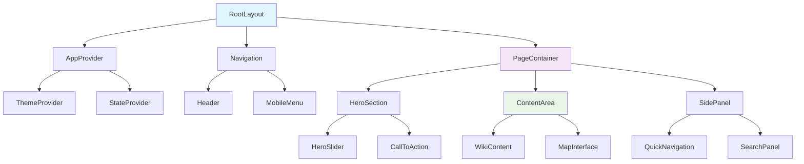
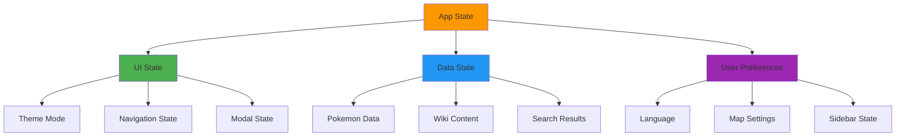
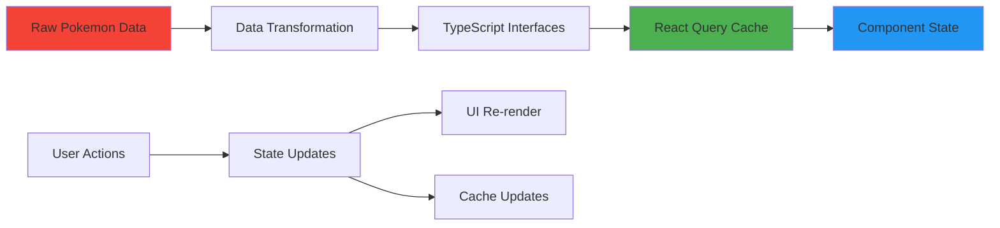
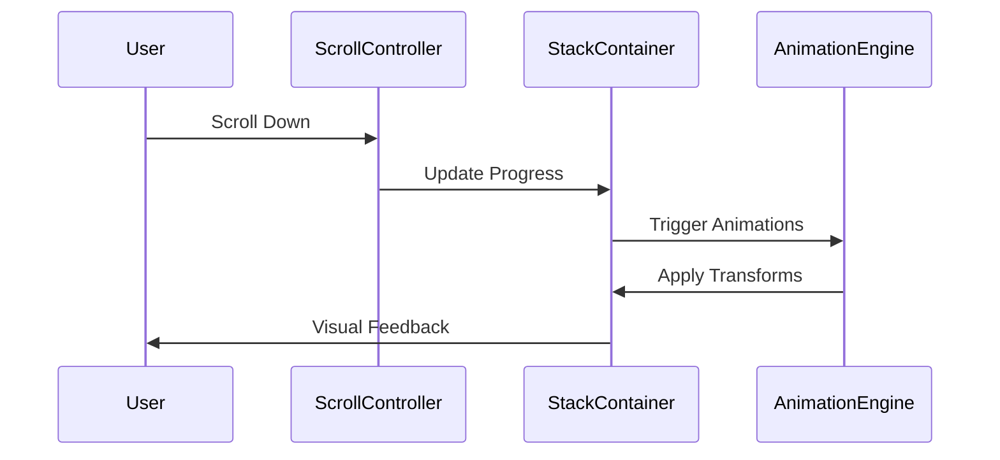
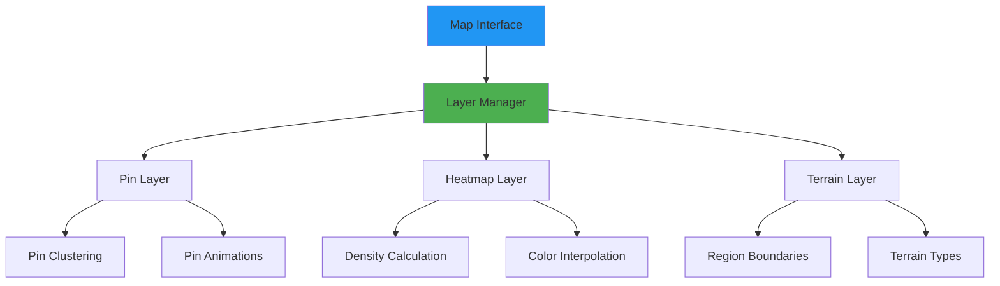
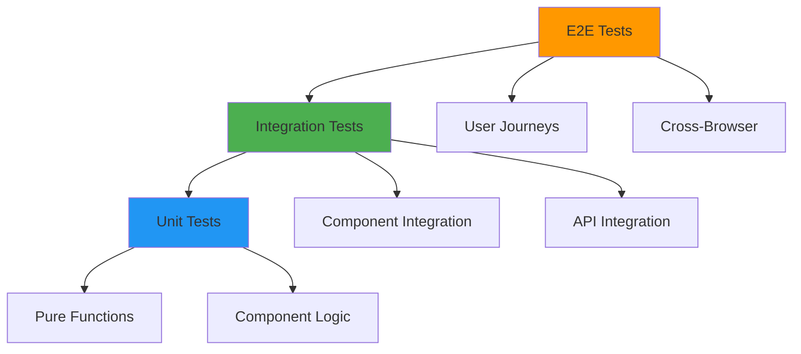
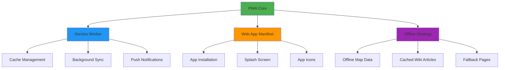
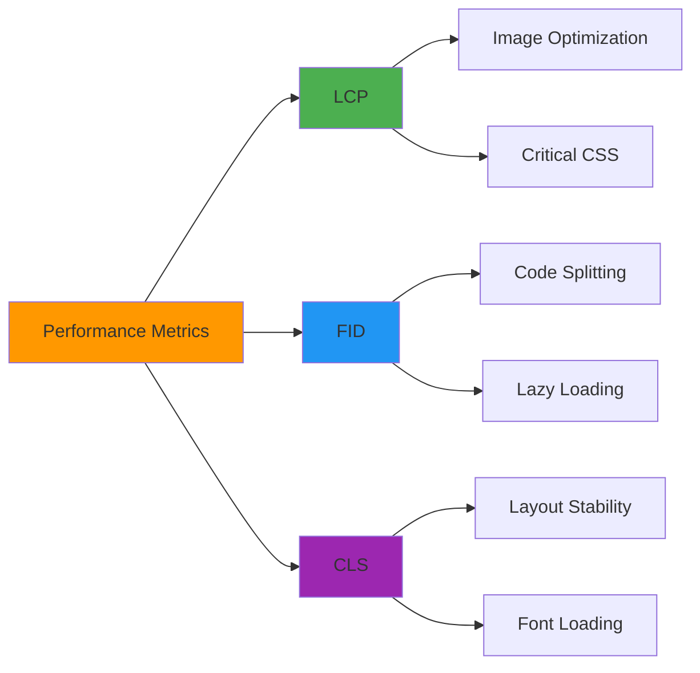
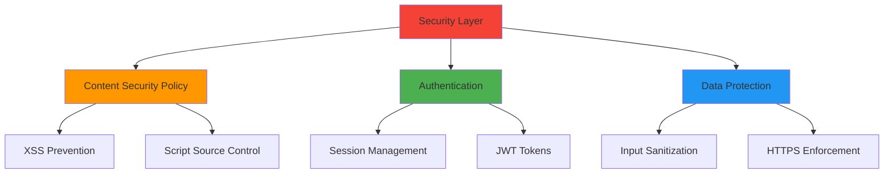
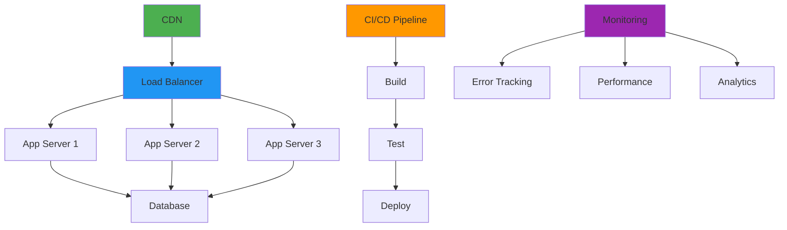

# Modern Pokémon Wiki Redesign - Technical Design Document

## Overview

This document outlines the complete redesign of the Poke Arkus wiki website, transforming it from its current Next.js structure to a modern, visually stunning platform inspired by contemporary design trends. The new site will feature a clean, minimalist interface with advanced UX patterns, improved performance, and enhanced user engagement.

### Project Goals
- **Modern Visual Identity**: Implement cutting-edge UI/UX design inspired by platforms like qoder.com
- **Enhanced User Experience**: Streamlined navigation, improved accessibility, and intuitive interactions  
- **Performance Optimization**: Faster loading times, optimized assets, and efficient data handling
- **Mobile-First Approach**: Responsive design prioritizing mobile user experience
- **Scalable Architecture**: Future-ready codebase for easy feature additions

### Target Audience
- Pokémon game enthusiasts seeking comprehensive game guides
- Players looking for interactive map functionality and location data
- Community members accessing wiki content for game strategies
- Mobile users requiring seamless cross-device experience

## Technology Stack & Dependencies

### Core Framework
```
Next.js 15+ (App Router)
React 18+
TypeScript 5+
```

### Styling & Animation
```
Tailwind CSS 3.4+
Framer Motion 10+
CSS Custom Properties (Design Tokens)
Radix UI Primitives
Lucide React Icons
```

### Performance & Optimization
```
Next.js Image Optimization
React Server Components
Streaming SSR
Dynamic Imports
Service Workers (PWA)
```

### Data & State Management
```
Zustand (Lightweight State Management)
React Query (Server State)
Local Storage (Preferences)
Session Storage (Temporary State)
```

## Component Architecture

### Design System Foundation

```mermaid
graph TB
    subgraph "Design System"
        DS[Design Tokens] --> Colors[Color Palette]
        DS --> Typography[Typography Scale]  
        DS --> Spacing[Spacing System]
        DS --> Shadows[Shadow Levels]
        DS --> Animations[Motion Presets]
    end
    
    subgraph "Atomic Components"
        Button[Button Variants]
        Input[Input Controls]
        Badge[Status Badges]
        Avatar[User Avatars]
        Card[Content Cards]
    end
    
    subgraph "Layout Components"
        Grid[Responsive Grid]
        Stack[Vertical Stack]
        Flex[Flex Container]
        Container[Page Container]
    end
    
    DS --> Button
    DS --> Input
    Layout Components --> Atomic Components
```

### Component Hierarchy



### Modern UI Components

#### Hero Section with Stack Scrolling
```
HeroSection/
├── StackScrollContainer.tsx    # Stacked cards animation
├── BannerSlide.tsx            # Individual banner slides
├── ParallaxBackground.tsx     # Depth effect background
└── HeroContent.tsx            # Main hero content
```

#### Interactive Map Module
```
MapInterface/
├── MapCanvas.tsx              # Main map rendering
├── LocationPins.tsx           # Pokémon location markers  
├── HeatmapOverlay.tsx         # Density visualization
├── MapControls.tsx            # Zoom, pan controls
├── LocationDetails.tsx        # Pin detail popup
└── MapSearch.tsx              # Location search
```

#### Wiki Content System
```
WikiSystem/
├── CategoryGrid.tsx           # Modern category layout
├── ArticleRenderer.tsx        # Dynamic content display
├── NavigationSidebar.tsx      # Collapsible navigation
├── SearchInterface.tsx        # Enhanced search
└── ContentTabs.tsx            # Tabbed content areas
```

## Routing & Navigation

### Site Architecture

```mermaid
graph LR
    A[/ - Homepage] --> B[/wiki - Wiki Hub]
    A --> C[/map - Interactive Map]
    A --> D[/download - Downloads]
    
    B --> E[/wiki/[category]]
    E --> F[/wiki/[category]/[article]]
    
    C --> G[MapInterface]
    G --> H[PokemonDetails]
    
    style A fill:#4caf50
    style B fill:#2196f3  
    style C fill:#ff9800
    style D fill:#9c27b0
```

### Navigation Patterns

#### Primary Navigation
- **Header Navigation**: Fixed header with logo, main menu, theme toggle, search
- **Mobile Navigation**: Slide-out drawer with gesture support
- **Breadcrumbs**: Dynamic breadcrumb trail for deep navigation

#### Secondary Navigation  
- **Sidebar Navigation**: Collapsible category tree with state persistence
- **Quick Actions**: Floating action buttons for common tasks
- **Search Interface**: Global search with autocomplete and filters

### Route Transitions
- **Page Transitions**: Smooth fade/slide animations between routes
- **Loading States**: Progressive loading with skeleton screens
- **Error Boundaries**: Graceful error handling with recovery options

## Styling Strategy

### Design Token System

#### Color Palette
```css
:root {
  /* Primary Colors */
  --color-primary-50: #f0f9ff;
  --color-primary-500: #3b82f6;
  --color-primary-900: #1e3a8a;
  
  /* Semantic Colors */
  --color-success: #10b981;
  --color-warning: #f59e0b;
  --color-error: #ef4444;
  
  /* Pokemon Type Colors */
  --type-fire: #ff6b35;
  --type-water: #4f8cc9;
  --type-grass: #7bc142;
  --type-electric: #f4d03f;
  
  /* Background Gradients */
  --bg-hero: linear-gradient(135deg, #667eea 0%, #764ba2 100%);
  --bg-card: rgba(255, 255, 255, 0.05);
}
```

#### Typography Scale
```css
:root {
  /* Font Families */
  --font-display: 'Inter', sans-serif;
  --font-body: 'Inter', sans-serif;
  --font-mono: 'JetBrains Mono', monospace;
  
  /* Font Sizes */
  --text-xs: 0.75rem;
  --text-sm: 0.875rem;
  --text-base: 1rem;
  --text-lg: 1.125rem;
  --text-xl: 1.25rem;
  --text-2xl: 1.5rem;
  --text-3xl: 1.875rem;
  --text-4xl: 2.25rem;
  --text-5xl: 3rem;
}
```

### Animation System

#### Motion Presets
```typescript
export const animations = {
  fadeIn: {
    initial: { opacity: 0 },
    animate: { opacity: 1 },
    transition: { duration: 0.3 }
  },
  slideUp: {
    initial: { y: 20, opacity: 0 },
    animate: { y: 0, opacity: 1 },
    transition: { duration: 0.4, ease: "easeOut" }
  },
  stagger: {
    animate: {
      transition: {
        staggerChildren: 0.1
      }
    }
  }
}
```

#### Micro-Interactions
- **Button Hover**: Scale and color transitions
- **Card Hover**: Lift effect with shadow
- **Loading States**: Pulse and shimmer animations  
- **Form Validation**: Shake animation for errors

## State Management

### Global State Architecture



### State Management Patterns

#### Zustand Store Structure
```typescript
interface AppStore {
  // UI State
  theme: 'light' | 'dark' | 'system'
  sidebarOpen: boolean
  
  // Search State  
  searchQuery: string
  searchResults: SearchResult[]
  
  // Map State
  selectedPokemon: string | null
  mapViewMode: 'pinpoint' | 'heatmap'
  
  // Actions
  setTheme: (theme: Theme) => void
  toggleSidebar: () => void
  updateSearch: (query: string) => void
}
```

#### React Query Integration
```typescript
// Pokemon data fetching
export const usePokemonData = () => {
  return useQuery({
    queryKey: ['pokemon'],
    queryFn: fetchPokemonData,
    staleTime: 5 * 60 * 1000, // 5 minutes
    cacheTime: 10 * 60 * 1000  // 10 minutes
  })
}
```

### Local Storage Strategy
- **User Preferences**: Theme, language, sidebar state
- **Map Settings**: Last viewed location, zoom level, view mode
- **Search History**: Recent searches and favorites
- **Performance Cache**: Frequently accessed data

## Data Architecture

### Data Flow Patterns



### Data Models

#### Pokemon Location Data
```typescript
interface PokemonLocation {
  id: string
  name: string
  dexNumber: number
  types: PokemonType[]
  locations: MapCoordinate[]
  rarity: 'common' | 'uncommon' | 'rare' | 'legendary'
  spawnConditions: SpawnCondition[]
}

interface MapCoordinate {
  x: number
  y: number
  z: number
  region: string
  terrain: TerrainType
  spawnRate: number
}
```

#### Wiki Content Structure
```typescript
interface WikiArticle {
  id: string
  slug: string
  title: string
  content: string
  category: WikiCategory
  tags: string[]
  lastUpdated: Date
  relatedArticles: string[]
}

interface WikiCategory {
  id: string
  name: string
  description: string
  icon: string
  subcategories: WikiCategory[]
}
```

### Data Processing Pipeline
1. **Raw Data Import**: Python scripts process game data files
2. **Type Generation**: Automatic TypeScript interface generation
3. **Data Validation**: Runtime validation with Zod schemas
4. **Cache Strategy**: Multi-level caching for optimal performance
5. **Error Handling**: Graceful fallbacks for missing data

## Feature Implementation

### Homepage Redesign

#### Stack Scrolling Hero Section


**Implementation Details:**
- **Intersection Observer**: Tracks scroll position for animation triggers
- **Transform Animations**: CSS transforms for smooth stack effects  
- **Performance Optimization**: RequestAnimationFrame for 60fps animations
- **Accessibility**: Reduced motion support for accessibility preferences

#### Modern Category Grid
- **Hover Effects**: Elegant card lift animations
- **Visual Hierarchy**: Clear information architecture
- **Progressive Disclosure**: Expandable content areas
- **Quick Actions**: One-click access to popular sections

### Interactive Map Enhancement

#### Advanced Visualization


**Enhanced Features:**
- **Multi-Layer Rendering**: Separate layers for different data types
- **Dynamic Clustering**: Intelligent grouping of nearby locations
- **Smooth Interactions**: Gesture-based navigation with momentum
- **Performance Optimization**: Viewport culling and LOD systems

#### Location Discovery
- **Smart Search**: Fuzzy search with autocomplete suggestions
- **Filter System**: Multiple filter criteria with visual feedback
- **Favorites**: Save and organize frequently accessed locations
- **Sharing**: Generate shareable links for specific locations

### Wiki System Modernization

#### Content Management
```typescript
interface ContentRenderer {
  renderArticle: (article: WikiArticle) => JSX.Element
  renderCategory: (category: WikiCategory) => JSX.Element
  renderSearch: (results: SearchResult[]) => JSX.Element
}
```

**Enhanced Features:**
- **Dynamic Rendering**: Component-based content rendering
- **Rich Media**: Support for images, videos, and interactive elements
- **Cross-References**: Automatic linking between related articles
- **Version Control**: Track content changes and updates

#### Search & Discovery
- **Global Search**: Site-wide search with intelligent ranking
- **Category Filters**: Refined search within specific categories
- **Visual Search**: Image-based search for Pokemon and items
- **Search Analytics**: Track popular searches for content optimization

## Responsive Design

### Breakpoint Strategy

```css
/* Mobile First Approach */
@media (min-width: 640px)  { /* sm */ }
@media (min-width: 768px)  { /* md */ }  
@media (min-width: 1024px) { /* lg */ }
@media (min-width: 1280px) { /* xl */ }
@media (min-width: 1536px) { /* 2xl */ }
```

### Responsive Patterns

#### Navigation Adaptation
- **Mobile**: Bottom tab bar with essential actions
- **Tablet**: Collapsible sidebar with full menu
- **Desktop**: Fixed header with expanded navigation

#### Content Layout
- **Mobile**: Single column, stack scrolling
- **Tablet**: Two-column with adaptive sidebar
- **Desktop**: Three-column with fixed panels

#### Map Interface
- **Touch Optimization**: Gesture-based controls for mobile
- **Viewport Adaptation**: Dynamic scaling based on screen size
- **Performance Scaling**: Reduced complexity on lower-end devices

### Accessibility Features

#### WCAG 2.1 Compliance
- **Keyboard Navigation**: Full keyboard accessibility
- **Screen Reader Support**: Semantic HTML and ARIA labels
- **Color Contrast**: Minimum 4.5:1 contrast ratios
- **Focus Management**: Clear focus indicators and logical tab order

#### Inclusive Design
- **Reduced Motion**: Respect user motion preferences
- **High Contrast Mode**: Enhanced contrast for visual impairments  
- **Text Scaling**: Support for 200% text zoom
- **Alternative Text**: Descriptive alt text for all images

## Testing Strategy

### Testing Pyramid



### Testing Framework Stack
```
Unit Testing: Jest + React Testing Library
Integration: Cypress Component Testing  
E2E Testing: Playwright
Visual Regression: Percy/Chromatic
Performance: Lighthouse CI
```

### Test Coverage Areas
- **Component Rendering**: Verify correct component output
- **User Interactions**: Test all interactive elements
- **Data Fetching**: Mock API responses and error states  
- **Navigation**: Verify routing and transitions
- **Accessibility**: Automated a11y testing with axe-core
- **Performance**: Core Web Vitals monitoring

### Continuous Testing
- **Pre-commit Hooks**: Run tests before code commits
- **Pull Request Checks**: Automated testing on PR creation
- **Deployment Testing**: Smoke tests on production deployments
- **Monitoring**: Real-time performance and error tracking

## Progressive Web App (PWA)

### PWA Features



### Service Worker Strategy

#### Cache-First for Static Assets
```typescript
// Static assets (images, CSS, JS)
const STATIC_CACHE = 'static-v1'
const staticAssets = [
  '/images/pokemon-sprites/',
  '/images/map-tiles/',
  '/css/globals.css',
  '/js/app.bundle.js'
]

// Cache-first strategy
self.addEventListener('fetch', (event) => {
  if (staticAssets.some(asset => event.request.url.includes(asset))) {
    event.respondWith(
      caches.match(event.request)
        .then(response => response || fetch(event.request))
    )
  }
})
```

#### Network-First for Dynamic Content
```typescript
// API data and dynamic content
const DYNAMIC_CACHE = 'dynamic-v1'

// Network-first with fallback
self.addEventListener('fetch', (event) => {
  if (event.request.url.includes('/api/')) {
    event.respondWith(
      fetch(event.request)
        .then(response => {
          const responseClone = response.clone()
          caches.open(DYNAMIC_CACHE)
            .then(cache => cache.put(event.request, responseClone))
          return response
        })
        .catch(() => caches.match(event.request))
    )
  }
})
```

### Offline Functionality

#### Map Offline Support
- **Tile Caching**: Pre-cache map tiles for popular regions
- **Location Data**: Store Pokemon location data locally
- **Last Known State**: Remember user's last map position and settings
- **Sync Queue**: Queue location updates for when online

#### Wiki Offline Access
- **Popular Articles**: Cache frequently accessed wiki pages
- **Reading List**: Allow users to save articles for offline reading
- **Search Index**: Local search functionality when offline
- **Content Updates**: Background sync when connection restored

### Installation & Engagement

#### App Manifest Configuration
```json
{
  "name": "Poke Arkus Wiki",
  "short_name": "PokeArkus",
  "description": "Complete Pokemon game guide and interactive map",
  "start_url": "/",
  "display": "standalone",
  "orientation": "portrait-primary",
  "theme_color": "#3b82f6",
  "background_color": "#ffffff",
  "icons": [
    {
      "src": "/icons/icon-192.png",
      "sizes": "192x192",
      "type": "image/png",
      "purpose": "maskable any"
    },
    {
      "src": "/icons/icon-512.png",
      "sizes": "512x512",
      "type": "image/png",
      "purpose": "maskable any"
    }
  ]
}
```

#### Push Notifications
- **Pokemon Alerts**: Notify about rare Pokemon spawns
- **Wiki Updates**: New articles and guide updates
- **Event Notifications**: Special game events and announcements
- **Personal Reminders**: Daily tasks and achievements

## Performance Optimization

### Core Web Vitals Strategy



### Loading Performance

#### Image Optimization Strategy
```typescript
// Next.js Image component configuration
const imageLoader = ({ src, width, quality }) => {
  return `https://cdn.pokearkus.com/${src}?w=${width}&q=${quality || 75}`
}

// Responsive image sizing
const pokemonImageSizes = {
  mobile: '(max-width: 768px) 100vw',
  tablet: '(max-width: 1024px) 50vw', 
  desktop: '33vw'
}
```

#### Code Splitting Patterns
```typescript
// Route-based splitting
const MapInterface = lazy(() => import('./components/MapInterface'))
const WikiSystem = lazy(() => import('./components/WikiSystem'))

// Component-based splitting
const HeatmapComponent = lazy(() => 
  import('./components/HeatmapComponent')
)

// Dynamic imports with loading states
const LazyMapComponent = () => (
  <Suspense fallback={<MapSkeleton />}>
    <MapInterface />
  </Suspense>
)
```

### Runtime Performance

#### Memory Management
```typescript
// Pokemon data virtualization
const VirtualizedPokemonList = () => {
  const [visibleItems, setVisibleItems] = useState([])
  
  useEffect(() => {
    // Only render visible items to prevent memory bloat
    const observer = new IntersectionObserver(
      (entries) => updateVisibleItems(entries),
      { rootMargin: '50px' }
    )
    
    return () => observer.disconnect()
  }, [])
}
```

#### Map Performance Optimization
```typescript
// Viewport culling for map pins
const getVisiblePins = (viewport, allPins) => {
  return allPins.filter(pin => {
    return pin.x >= viewport.left && 
           pin.x <= viewport.right &&
           pin.y >= viewport.top && 
           pin.y <= viewport.bottom
  })
}

// Pin clustering for performance
const clusterPins = (pins, zoomLevel) => {
  const clusterRadius = 50 / zoomLevel
  return performClustering(pins, clusterRadius)
}
```

### Bundle Optimization

#### Webpack Configuration
```javascript
module.exports = {
  optimization: {
    splitChunks: {
      chunks: 'all',
      cacheGroups: {
        vendor: {
          test: /[\\/]node_modules[\\/]/,
          name: 'vendors',
          chunks: 'all'
        },
        common: {
          minChunks: 2,
          chunks: 'all',
          name: 'common'
        }
      }
    }
  }
}
```

#### Tree Shaking Strategy
- **ES6 Modules**: Use ES6 imports for better tree shaking
- **Selective Imports**: Import only needed functions from libraries
- **Bundle Analysis**: Regular analysis with webpack-bundle-analyzer
- **Dead Code Elimination**: Remove unused code automatically

## Security Implementation

### Security Architecture



### Content Security Policy

```html
<!-- Strict CSP configuration -->
<meta http-equiv="Content-Security-Policy" content="
  default-src 'self';
  script-src 'self' 'unsafe-inline' https://cdn.pokearkus.com;
  style-src 'self' 'unsafe-inline' https://fonts.googleapis.com;
  img-src 'self' data: https://cdn.pokearkus.com https://assets.pokemon.com;
  connect-src 'self' https://api.pokearkus.com;
  font-src 'self' https://fonts.gstatic.com;
  frame-src 'none';
  object-src 'none';
">
```

### Input Security

#### Sanitization Strategy
```typescript
// Input sanitization for search
import DOMPurify from 'dompurify'

const sanitizeSearchInput = (input: string): string => {
  return DOMPurify.sanitize(input, {
    ALLOWED_TAGS: [],
    ALLOWED_ATTR: []
  })
}

// XSS prevention for user content
const sanitizeUserContent = (content: string): string => {
  return DOMPurify.sanitize(content, {
    ALLOWED_TAGS: ['p', 'br', 'strong', 'em'],
    ALLOWED_ATTR: []
  })
}
```

#### Rate Limiting
```typescript
// API rate limiting
const rateLimiter = {
  windowMs: 15 * 60 * 1000, // 15 minutes
  max: 100, // Limit each IP to 100 requests per windowMs
  message: 'Too many requests from this IP'
}

// Search rate limiting
const searchLimiter = {
  windowMs: 60 * 1000, // 1 minute
  max: 30, // 30 searches per minute
  skipSuccessfulRequests: true
}
```

### Data Protection

#### Privacy Compliance
- **GDPR Compliance**: Cookie consent and data processing transparency
- **Data Minimization**: Collect only necessary user data
- **User Rights**: Data export, deletion, and modification capabilities
- **Audit Logging**: Track data access and modifications

#### Secure Storage
```typescript
// Encrypted local storage
const secureStorage = {
  setItem: (key: string, value: any) => {
    const encrypted = CryptoJS.AES.encrypt(
      JSON.stringify(value),
      process.env.STORAGE_KEY
    ).toString()
    localStorage.setItem(key, encrypted)
  },
  
  getItem: (key: string) => {
    const encrypted = localStorage.getItem(key)
    if (!encrypted) return null
    
    const decrypted = CryptoJS.AES.decrypt(
      encrypted,
      process.env.STORAGE_KEY
    ).toString(CryptoJS.enc.Utf8)
    
    return JSON.parse(decrypted)
  }
}
```

## Deployment Architecture

### Infrastructure Overview



### Deployment Strategy

#### Multi-Environment Setup
```yaml
# Docker configuration
version: '3.8'
services:
  app:
    build: .
    ports:
      - "3000:3000"
    environment:
      - NODE_ENV=production
      - DATABASE_URL=${DATABASE_URL}
    volumes:
      - ./uploads:/app/uploads
    restart: unless-stopped

  nginx:
    image: nginx:alpine
    ports:
      - "80:80"
      - "443:443"
    volumes:
      - ./nginx.conf:/etc/nginx/nginx.conf
      - ./ssl:/etc/ssl
    depends_on:
      - app
```

#### CI/CD Pipeline
```yaml
# GitHub Actions workflow
name: Deploy to Production

on:
  push:
    branches: [main]

jobs:
  deploy:
    runs-on: ubuntu-latest
    steps:
      - uses: actions/checkout@v3
      
      - name: Setup Node.js
        uses: actions/setup-node@v3
        with:
          node-version: '18'
          
      - name: Install dependencies
        run: npm ci
        
      - name: Run tests
        run: npm test
        
      - name: Build application
        run: npm run build
        
      - name: Deploy to production
        run: |
          docker build -t pokearkus-app .
          docker push registry.pokearkus.com/app:latest
```

### Monitoring & Analytics

#### Performance Monitoring
```typescript
// Core Web Vitals tracking
const reportWebVitals = (metric) => {
  switch (metric.name) {
    case 'LCP':
      analytics.track('Largest Contentful Paint', {
        value: metric.value,
        rating: metric.rating
      })
      break
    case 'FID':
      analytics.track('First Input Delay', {
        value: metric.value,
        rating: metric.rating
      })
      break
    case 'CLS':
      analytics.track('Cumulative Layout Shift', {
        value: metric.value,
        rating: metric.rating
      })
      break
  }
}
```

#### Error Tracking
```typescript
// Sentry integration for error monitoring
import * as Sentry from '@sentry/nextjs'

Sentry.init({
  dsn: process.env.SENTRY_DSN,
  environment: process.env.NODE_ENV,
  integrations: [
    new Sentry.BrowserTracing({
      tracePropagationTargets: ['localhost', 'pokearkus.com']
    })
  ],
  tracesSampleRate: 0.1,
  beforeSend: (event) => {
    // Filter out non-critical errors
    if (event.exception) {
      const error = event.exception.values[0]
      if (error.type === 'NetworkError') return null
    }
    return event
  }
})
```

### Scalability Planning

#### Auto-scaling Configuration
- **Horizontal Scaling**: Multiple server instances behind load balancer
- **Database Scaling**: Read replicas for improved performance
- **CDN Integration**: Global content distribution
- **Caching Layers**: Redis for session and data caching

#### Load Testing Strategy
```javascript
// K6 load testing script
import http from 'k6/http'
import { check } from 'k6'

export let options = {
  stages: [
    { duration: '2m', target: 100 },
    { duration: '5m', target: 500 },
    { duration: '2m', target: 0 }
  ]
}

export default function() {
  const response = http.get('https://pokearkus.com/api/pokemon')
  check(response, {
    'status is 200': (r) => r.status === 200,
    'response time < 500ms': (r) => r.timings.duration < 500
  })
}
```

## Implementation Guide

### Project Setup Instructions

#### 1. Initialize New Project Directory
```bash
# Navigate to target location
cd "D:\Poke Arkus\"
mkdir wikiarkus2
cd wikiarkus2

# Initialize Next.js project
npx create-next-app@latest . --typescript --tailwind --eslint --app --src-dir=false

# Install additional dependencies
npm install framer-motion zustand @tanstack/react-query
npm install @radix-ui/react-accordion @radix-ui/react-dialog
npm install lucide-react class-variance-authority clsx
npm install heatmap.js react-hot-toast
```

#### 2. Project Structure
```
wikiarkus2/
├── app/
│   ├── globals.css
│   ├── layout.tsx
│   ├── page.tsx
│   ├── map/
│   │   ├── page.tsx
│   │   └── components/
│   └── wiki/
│       ├── page.tsx
│       └── [category]/
├── components/
│   ├── ui/              # Radix primitives
│   ├── layout/          # Layout components
│   ├── hero/            # Hero section components
│   ├── map/             # Map components
│   └── wiki/            # Wiki components
├── lib/
│   ├── utils.ts
│   ├── animations.ts
│   └── store.ts
├── data/
│   ├── pokemon.ts
│   └── categories.ts
└── public/
    ├── images/
    └── icons/
```

### Core Implementation Steps

#### Step 1: Design System Setup
```typescript
// lib/design-tokens.ts
export const colors = {
  primary: {
    50: '#f0f9ff',
    500: '#3b82f6',
    900: '#1e3a8a'
  },
  pokemon: {
    fire: '#ff6b35',
    water: '#4f8cc9',
    grass: '#7bc142'
  }
}

export const animations = {
  fadeIn: {
    initial: { opacity: 0 },
    animate: { opacity: 1 },
    transition: { duration: 0.3 }
  }
}
```

#### Step 2: State Management
```typescript
// lib/store.ts
import { create } from 'zustand'

interface AppStore {
  theme: 'light' | 'dark'
  selectedPokemon: string | null
  mapViewMode: 'pinpoint' | 'heatmap'
  setTheme: (theme: 'light' | 'dark') => void
  setSelectedPokemon: (pokemon: string | null) => void
}

export const useAppStore = create<AppStore>((set) => ({
  theme: 'light',
  selectedPokemon: null,
  mapViewMode: 'pinpoint',
  setTheme: (theme) => set({ theme }),
  setSelectedPokemon: (pokemon) => set({ selectedPokemon: pokemon })
}))
```

#### Step 3: Modern Hero Section
```typescript
// components/hero/StackScrollHero.tsx
'use client'
import { motion, useScroll, useTransform } from 'framer-motion'

export function StackScrollHero() {
  const { scrollYProgress } = useScroll()
  const y = useTransform(scrollYProgress, [0, 1], [0, -300])
  
  return (
    <section className="relative h-screen overflow-hidden">
      <motion.div
        style={{ y }}
        className="absolute inset-0 bg-gradient-to-br from-blue-600 to-purple-800"
      >
        <div className="flex items-center justify-center h-full">
          <motion.h1
            initial={{ opacity: 0, y: 50 }}
            animate={{ opacity: 1, y: 0 }}
            className="text-6xl font-bold text-white text-center"
          >
            Poke Arkus
          </motion.h1>
        </div>
      </motion.div>
    </section>
  )
}
```

### Data Migration Strategy

#### 1. Copy Existing Data
```bash
# Copy Pokemon data from original project
cp "../wikiarkus/project/app/mapa/data.ts" "./data/pokemon.ts"
cp "../wikiarkus/project/data/categories.ts" "./data/"

# Copy assets
cp -r "../wikiarkus/project/public/" "./public/"
```

#### 2. Update Data Structure
```typescript
// data/pokemon.ts (updated)
export interface PokemonLocation {
  id: string
  name: string
  dexNumber: number
  types: PokemonType[]
  locations: MapCoordinate[]
  rarity: 'common' | 'uncommon' | 'rare' | 'legendary'
}

// Enhanced with new properties
export const pokemonData: PokemonLocation[] = [
  // Migrated data with enhancements
]
```

### Development Workflow

#### 1. Development Commands
```bash
# Start development server
npm run dev

# Build for production
npm run build

# Run linting
npm run lint

# Type checking
npm run type-check
```

#### 2. Testing Setup
```bash
# Install testing dependencies
npm install --save-dev jest @testing-library/react @testing-library/jest-dom
npm install --save-dev @playwright/test

# Run tests
npm test
npm run test:e2e
```

This implementation guide provides the complete foundation for setting up your new modern website at D:\Poke Arkus\wikiarkus2 with all the enhanced features designed in this document.