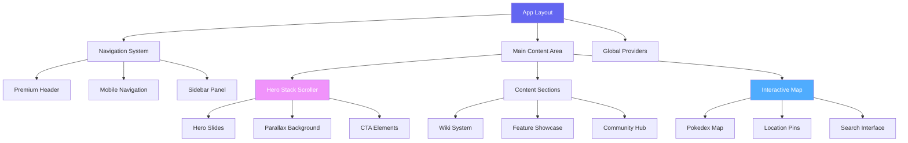
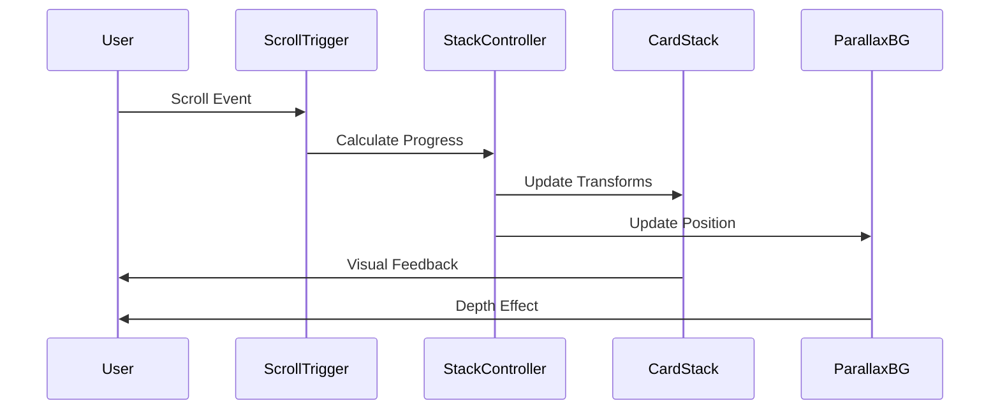
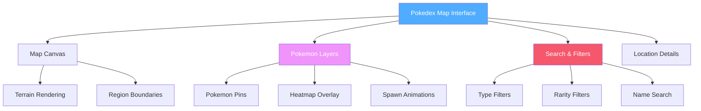
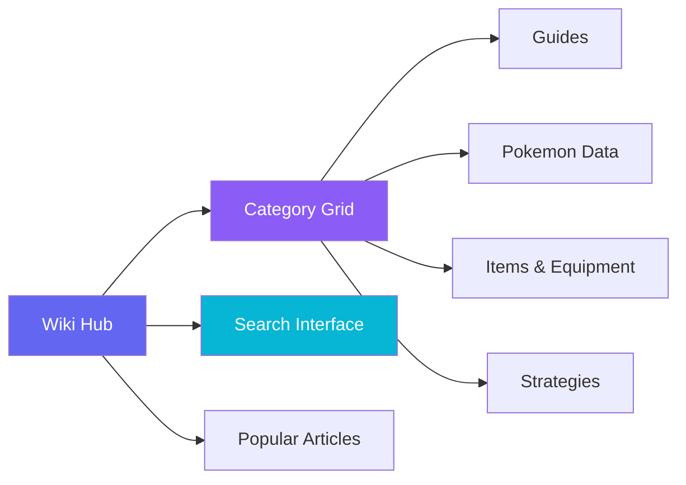
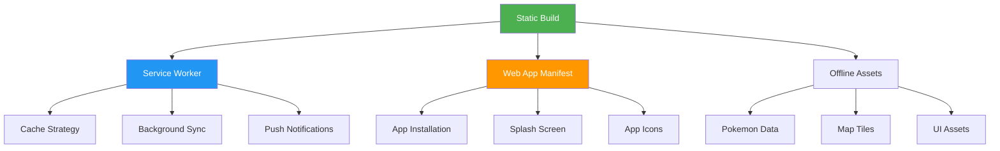

# Poke Arkus - Premium Website Redesign

## Overview

This document outlines the complete visual and architectural transformation of the Poke Arkus wiki website, elevating it from its current rough implementation to a sophisticated, premium-grade platform inspired by cutting-edge design systems like qoder.com. The redesign focuses on creating a seamless, polished user experience with advanced micro-interactions, cinematic animations, and a refined visual hierarchy.

### Design Philosophy
- **Sophisticated Minimalism**: Clean, purposeful design with strategic use of whitespace and typography
- **Cinematic Interactions**: Smooth, meaningful animations that guide user attention and create delight
- **Premium Feel**: High-quality visual elements that elevate the perceived value and professionalism
- **Intuitive Navigation**: Effortless user journeys with predictive and contextual interactions
- **Visual Storytelling**: Each section tells a story through progressive disclosure and visual hierarchy

### Project Goals
- **Modern Visual Identity**: Implement cutting-edge UI/UX design inspired by platforms like qoder.com
- **Enhanced User Experience**: Streamlined navigation, improved accessibility, and intuitive interactions
- **Performance Optimization**: Faster loading times, optimized assets, and efficient data handling
- **Mobile-First Approach**: Responsive design prioritizing mobile user experience
- **Scalable Architecture**: Future-ready codebase for easy feature additions

### Target Audience
- Pokémon game enthusiasts seeking comprehensive game guides
- Players looking for interactive map functionality and location data
- Community members accessing wiki content for game strategies
- Mobile users requiring seamless cross-device experience

## Technology Stack & Dependencies

### Core Framework
```
Next.js 15+ (App Router)
React 18+
TypeScript 5+
```

### Styling & Animation
```
Tailwind CSS 3.4+
Framer Motion 10+
CSS Custom Properties (Design Tokens)
Radix UI Primitives
Lucide React Icons
```

### Performance & Optimization
```
Next.js Image Optimization
React Server Components
Streaming SSR
Dynamic Imports
Service Workers (PWA)
```

### Data & State Management
```
Zustand (Lightweight State Management)
React Query (Server State)
Local Storage (Preferences)
Session Storage (Temporary State)
```

## Visual Design System

### Premium Color Palette

```css
:root {
  /* Primary Palette - Inspired by qoder.com sophistication */
  --color-primary-50: #f0f4ff;
  --color-primary-100: #e0e7ff;
  --color-primary-500: #6366f1;
  --color-primary-600: #4f46e5;
  --color-primary-900: #312e81;
  
  /* Pokemon-Themed Accent Colors */
  --pokemon-electric: #f7d02c;
  --pokemon-fire: #ff6b35;
  --pokemon-water: #4f8cc9;
  --pokemon-grass: #7bc142;
  --pokemon-psychic: #f366b9;
  --pokemon-dragon: #6f35fc;
  
  /* Sophisticated Background Gradients */
  --bg-hero-primary: linear-gradient(135deg, #667eea 0%, #764ba2 100%);
  --bg-hero-pokemon: linear-gradient(135deg, #f093fb 0%, #f5576c 50%, #4facfe 100%);
  --bg-card-glass: rgba(255, 255, 255, 0.08);
  --bg-card-border: rgba(255, 255, 255, 0.12);
}
```

### Typography System

```css
:root {
  /* Font Families */
  --font-display: 'Inter', -apple-system, BlinkMacSystemFont, sans-serif;
  --font-body: 'Inter', -apple-system, BlinkMacSystemFont, sans-serif;
  --font-mono: 'JetBrains Mono', 'Fira Code', monospace;
  
  /* Refined Font Scale */
  --text-xs: 0.75rem;     /* 12px */
  --text-sm: 0.875rem;    /* 14px */
  --text-base: 1rem;      /* 16px */
  --text-lg: 1.125rem;    /* 18px */
  --text-xl: 1.25rem;     /* 20px */
  --text-2xl: 1.5rem;     /* 24px */
  --text-3xl: 1.875rem;   /* 30px */
  --text-4xl: 2.25rem;    /* 36px */
  --text-5xl: 3rem;       /* 48px */
  --text-6xl: 3.75rem;    /* 60px */
}
```

## Component Architecture

### Sophisticated Component Hierarchy



### Premium UI Components

#### Glass Morphism Design System
```typescript
const GlassCard = ({ children, className }) => (
  <motion.div
    initial={{ opacity: 0, y: 20 }}
    whileInView={{ opacity: 1, y: 0 }}
    transition={{ duration: 0.6 }}
    className={cn(
      'backdrop-blur-md bg-white/10 border border-white/20',
      'rounded-2xl p-6 shadow-xl',
      'hover:bg-white/15 hover:border-white/30 transition-all duration-300',
      className
    )}
  >
    {children}
  </motion.div>
)
```

#### Sophisticated Button System
```typescript
const PremiumButton = ({ children, variant = 'primary', size = 'md' }) => (
  <motion.button
    whileHover={{ scale: 1.02, y: -1 }}
    whileTap={{ scale: 0.98 }}
    className={cn(
      'relative overflow-hidden rounded-lg font-medium transition-all duration-300',
      'before:absolute before:inset-0 before:bg-gradient-to-r before:opacity-0 before:transition-opacity',
      'hover:before:opacity-100 hover:shadow-lg',
      buttonVariants({ variant, size })
    )}
  >
    <span className="relative z-10">{children}</span>
  </motion.button>
)
```

## Homepage Redesign - Stack Scroller Implementation

### Cinematic Stack Scrolling Hero



### Hero Stack Implementation
```typescript
const HeroStackScroller = () => {
  const { scrollYProgress } = useScroll()
  const containerRef = useRef(null)
  
  // Stack animation values
  const stack1Y = useTransform(scrollYProgress, [0, 0.3], [0, -100])
  const stack2Y = useTransform(scrollYProgress, [0, 0.4], [0, -200])
  const stack3Y = useTransform(scrollYProgress, [0, 0.5], [0, -300])
  
  const heroStacks = [
    {
      id: 'pokemon-world',
      title: 'Explore the Pokemon World',
      description: 'Discover every location, Pokemon, and secret in our comprehensive guide',
      gradient: 'from-purple-600 via-pink-600 to-blue-600'
    },
    {
      id: 'interactive-map',
      title: 'Interactive Pokedex Map',
      description: 'Real-time Pokemon locations with advanced filtering and search',
      gradient: 'from-blue-600 via-cyan-600 to-green-600'
    },
    {
      id: 'community-guides',
      title: 'Community-Driven Guides',
      description: 'Expert strategies, tips, and comprehensive walkthroughs',
      gradient: 'from-orange-600 via-red-600 to-pink-600'
    }
  ]
  
  return (
    <section ref={containerRef} className="relative h-[300vh] overflow-hidden">
      <div className="sticky top-0 h-screen flex items-center justify-center">
        {heroStacks.map((stack, index) => (
          <motion.div
            key={stack.id}
            style={{
              y: index === 0 ? stack1Y : index === 1 ? stack2Y : stack3Y,
              zIndex: heroStacks.length - index
            }}
            className={cn(
              'absolute inset-4 rounded-3xl overflow-hidden',
              'bg-gradient-to-br shadow-2xl',
              stack.gradient
            )}
          >
            <div className="relative z-10 h-full flex flex-col justify-center items-center text-white p-8">
              <motion.h2
                initial={{ opacity: 0, y: 30 }}
                whileInView={{ opacity: 1, y: 0 }}
                transition={{ delay: index * 0.2 }}
                className="text-5xl font-bold mb-4 text-center"
              >
                {stack.title}
              </motion.h2>
              <motion.p
                initial={{ opacity: 0, y: 20 }}
                whileInView={{ opacity: 1, y: 0 }}
                transition={{ delay: index * 0.2 + 0.1 }}
                className="text-xl text-center max-w-2xl opacity-90"
              >
                {stack.description}
              </motion.p>
            </div>
          </motion.div>
        ))}
      </div>
    </section>
  )
}
```

## Interactive Pokedex Map

### Pokemon-Themed Map Interface



### Advanced Map Component
```typescript
const PokedexMap = () => {
  const [selectedPokemon, setSelectedPokemon] = useState(null)
  const [mapViewMode, setMapViewMode] = useState('pinpoint')
  const [activeFilters, setActiveFilters] = useState({
    types: [],
    rarity: [],
    region: 'all'
  })
  
  return (
    <div className="relative w-full h-screen from-blue-900 via-purple-900 to-indigo-900">
      {/* Premium Map Header */}
      <div className="absolute top-0 left-0 right-0 z-20 p-6">
        <div className="flex items-center justify-between">
          <motion.h1
            initial={{ opacity: 0, x: -20 }}
            animate={{ opacity: 1, x: 0 }}
            className="text-3xl font-bold text-white"
          >
            Pokedex Map
          </motion.h1>
          
          {/* Sophisticated View Toggle */}
          <div className="flex items-center space-x-4">
            <motion.button
              whileHover={{ scale: 1.05 }}
              whileTap={{ scale: 0.95 }}
              onClick={() => setMapViewMode('pinpoint')}
              className={cn(
                'px-4 py-2 rounded-lg font-medium transition-all',
                mapViewMode === 'pinpoint'
                  ? 'bg-white text-purple-900 shadow-lg'
                  : 'bg-white/20 text-white hover:bg-white/30'
              )}
            >
              Pinpoint View
            </motion.button>
            <motion.button
              whileHover={{ scale: 1.05 }}
              whileTap={{ scale: 0.95 }}
              onClick={() => setMapViewMode('heatmap')}
              className={cn(
                'px-4 py-2 rounded-lg font-medium transition-all',
                mapViewMode === 'heatmap'
                  ? 'bg-white text-purple-900 shadow-lg'
                  : 'bg-white/20 text-white hover:bg-white/30'
              )}
            >
              Heatmap View
            </motion.button>
          </div>
        </div>
      </div>
      
      {/* Map Canvas and Controls */}
      <div className="w-full h-full relative">
        {mapViewMode === 'pinpoint' ? (
          <PinpointMapLayer
            onPokemonSelect={setSelectedPokemon}
          />
        ) : (
          <HeatmapLayer />
        )}
      </div>
    </div>
  )
}
```

## Modern Wiki System

### Enhanced Content Architecture



### Premium Category Cards
```typescript
const WikiCategoryGrid = () => {
  const categories = [
    {
      id: 'pokemon',
      title: 'Pokédex',
      description: 'Complete database with stats, locations, and evolution data',
      icon: '🐾',
      gradient: 'from-blue-500 to-purple-600',
      articles: 1247
    },
    {
      id: 'guides',
      title: 'Strategy Guides',
      description: 'Expert guides for beginners and advanced players',
      icon: '📖',
      gradient: 'from-green-500 to-teal-600',
      articles: 89
    },
    {
      id: 'items',
      title: 'Items & Equipment',
      description: 'Complete catalog of items and equipment',
      icon: '🎒',
      gradient: 'from-orange-500 to-red-600',
      articles: 342
    }
  ]
  
  return (
    <section className="py-16 px-4">
      <div className="max-w-6xl mx-auto">
        <div className="grid grid-cols-1 md:grid-cols-2 lg:grid-cols-3 gap-6">
          {categories.map((category, index) => (
            <motion.div
              key={category.id}
              initial={{ opacity: 0, y: 30 }}
              whileInView={{ opacity: 1, y: 0 }}
              transition={{ duration: 0.6, delay: index * 0.1 }}
              className="group cursor-pointer"
            >
              <div className={cn(
                'relative h-64 rounded-2xl overflow-hidden',
                'bg-gradient-to-br shadow-lg',
                'hover:shadow-xl hover:scale-105 transition-all duration-300',
                category.gradient
              )}>
                <div className="relative z-10 h-full p-6 flex flex-col justify-between text-white">
                  <div>
                    <div className="text-4xl mb-3">{category.icon}</div>
                    <h3 className="text-2xl font-bold mb-2">{category.title}</h3>
                    <p className="text-white/80 text-sm">
                      {category.description}
                    </p>
                  </div>
                  <div className="text-sm font-medium">
                    {category.articles} articles
                  </div>
                </div>
              </div>
            </motion.div>
          ))}
        </div>
      </div>
    </section>
  )
}
```

## Progressive Web App (PWA) Implementation

### Static PWA Architecture



### Service Worker for Static Export

```typescript
// public/sw.js - Optimized for static sites
const CACHE_NAME = 'pokearkus-v1'
const STATIC_ASSETS = [
  '/',
  '/wiki',
  '/map',
  '/manifest.json',
  '/_next/static/chunks/pages/_app.js',
  '/_next/static/css/app.css'
]

// Install event - cache critical assets
self.addEventListener('install', (event) => {
  event.waitUntil(
    caches.open(CACHE_NAME)
      .then(cache => cache.addAll(STATIC_ASSETS))
      .then(() => self.skipWaiting())
  )
})

// Fetch event - serve from cache, fallback to network
self.addEventListener('fetch', (event) => {
  event.respondWith(
    caches.match(event.request)
      .then(response => {
        if (response) {
          return response
        }
        return fetch(event.request)
      })
  )
})
```

### Offline Pokemon Data Strategy

```typescript
// lib/offline-data.ts
export const preloadPokemonData = async () => {
  const pokemonData = await import('../data/pokemon-locations.json')
  const mapTiles = await import('../data/map-tiles.json')
  
  // Store in IndexedDB for offline access
  const db = await openDB('pokearkus-db', 1, {
    upgrade(db) {
      db.createObjectStore('pokemon')
      db.createObjectStore('mapTiles')
    }
  })
  
  await db.put('pokemon', pokemonData, 'locations')
  await db.put('mapTiles', mapTiles, 'tiles')
}
```

## Advanced Visual Features

### 3D Pokemon Models Integration

```typescript
// components/3d/PokemonModel.tsx
import { Canvas } from '@react-three/fiber'
import { Suspense } from 'react'

const Pokemon3DCard = ({ pokemonId, name }) => {
  return (
    <div className="relative w-64 h-64 rounded-2xl overflow-hidden from-blue-500 to-purple-600">
      <Canvas camera={{ position: [0, 0, 5], fov: 45 }}>
        <Suspense fallback={<PokemonSkeleton />}>
          <ambientLight intensity={0.5} />
          <spotLight position={[10, 10, 10]} angle={0.15} penumbra={1} />
          <PokemonModel pokemonId={pokemonId} />
        </Suspense>
      </Canvas>
      
      <div className="absolute bottom-0 left-0 right-0 p-4 bg-gradient-to-t from-black/60 to-transparent">
        <h3 className="text-white font-bold text-lg">{name}</h3>
      </div>
    </div>
  )
}
```

### Particle Effects System

```typescript
// components/effects/ParticleSystem.tsx
import { motion } from 'framer-motion'

const PokemonDiscoveryEffect = ({ isVisible, pokemonType }) => {
  const particleColors = {
    fire: ['#ff6b35', '#ff8c42', '#ffa726'],
    water: ['#4f8cc9', '#42a5f5', '#29b6f6'],
    grass: ['#7bc142', '#66bb6a', '#4caf50'],
    electric: ['#f7d02c', '#ffeb3b', '#fdd835']
  }
  
  return (
    <AnimatePresence>
      {isVisible && (
        <motion.div
          initial={{ opacity: 0, scale: 0 }}
          animate={{ opacity: 1, scale: 1 }}
          exit={{ opacity: 0, scale: 0 }}
          className="absolute inset-0 pointer-events-none"
        >
          {Array.from({ length: 20 }).map((_, i) => (
            <motion.div
              key={i}
              initial={{
                x: '50%',
                y: '50%',
                opacity: 1
              }}
              animate={{
                x: `${50 + (Math.random() - 0.5) * 200}%`,
                y: `${50 + (Math.random() - 0.5) * 200}%`,
                opacity: 0
              }}
              transition={{
                duration: 2,
                delay: i * 0.1
              }}
              className="absolute w-2 h-2 rounded-full"
              style={{
                backgroundColor: particleColors[pokemonType]?.[i % 3] || '#fff'
              }}
            />
          ))}
        </motion.div>
      )}
    </AnimatePresence>
  )
}
```

### Enhanced Theme System

```typescript
// lib/theme-system.ts
export const pokemonThemes = {
  classic: {
    name: 'Classic',
    colors: {
      primary: '#3b82f6',
      secondary: '#8b5cf6',
      background: '#ffffff',
      surface: '#f8fafc'
    }
  },
  teamRocket: {
    name: 'Team Rocket',
    colors: {
      primary: '#7c3aed',
      secondary: '#ec4899',
      background: '#0f0f23',
      surface: '#1a1a2e'
    }
  },
  professorOak: {
    name: 'Professor Oak',
    colors: {
      primary: '#059669',
      secondary: '#0891b2',
      background: '#f0fdf4',
      surface: '#dcfce7'
    }
  },
  shiny: {
    name: 'Shiny',
    colors: {
      primary: '#f59e0b',
      secondary: '#ef4444',
      background: '#fffbeb',
      surface: '#fef3c7'
    }
  }
}

// Smooth theme transitions
export const useThemeTransition = () => {
  const [currentTheme, setCurrentTheme] = useState('classic')
  
  const changeTheme = useCallback((newTheme: string) => {
    document.documentElement.style.setProperty('--transition-duration', '0.3s')
    
    const theme = pokemonThemes[newTheme]
    Object.entries(theme.colors).forEach(([key, value]) => {
      document.documentElement.style.setProperty(`--color-${key}`, value)
    })
    
    setCurrentTheme(newTheme)
    localStorage.setItem('pokemon-theme', newTheme)
  }, [])
  
  return { currentTheme, changeTheme }
}
```

## Static Export Optimization

### Next.js Configuration for Static Export

```javascript
// next.config.js
/** @type {import('next').NextConfig} */
const nextConfig = {
  output: 'export',
  trailingSlash: true,
  images: {
    unoptimized: true
  },
  experimental: {
    optimizeCss: true
  },
  compiler: {
    removeConsole: process.env.NODE_ENV === 'production'
  }
}

module.exports = nextConfig
```

### Build Optimization for Static Sites

```typescript
// lib/static-optimization.ts
export const generateStaticPaths = async () => {
  const pokemonData = await import('../data/pokemon.json')
  const wikiCategories = await import('../data/wiki-categories.json')
  
  return {
    pokemon: pokemonData.map(p => ({ params: { id: p.id.toString() } })),
    wiki: wikiCategories.flatMap(cat => 
      cat.articles.map(article => ({ 
        params: { 
          category: cat.slug, 
          article: article.slug 
        } 
      }))
    )
  }
}

// Pre-generate all static data at build time
export const getStaticProps = async ({ params }) => {
  const pokemonData = await import('../data/pokemon-locations.json')
  const mapData = await import('../data/map-regions.json')
  
  return {
    props: {
      pokemon: pokemonData.filter(p => p.region === params.region),
      mapRegions: mapData
    }
  }
}
```

### Mobile-First Touch Optimizations

```typescript
// components/touch/TouchOptimized.tsx
const TouchOptimizedMap = () => {
  const [touchStart, setTouchStart] = useState(null)
  const [touchEnd, setTouchEnd] = useState(null)
  
  const handleTouchStart = (e) => {
    setTouchStart(e.targetTouches[0].clientX)
  }
  
  const handleTouchMove = (e) => {
    setTouchEnd(e.targetTouches[0].clientX)
  }
  
  const handleTouchEnd = () => {
    if (!touchStart || !touchEnd) return
    
    const distance = touchStart - touchEnd
    const isLeftSwipe = distance > 50
    const isRightSwipe = distance < -50
    
    if (isLeftSwipe) {
      // Navigate to next Pokemon
      navigateNext()
    }
    if (isRightSwipe) {
      // Navigate to previous Pokemon
      navigatePrevious()
    }
  }
  
  return (
    <div
      onTouchStart={handleTouchStart}
      onTouchMove={handleTouchMove}
      onTouchEnd={handleTouchEnd}
      className="touch-manipulation"
    >
      {/* Map content */}
    </div>
  )
}
```

## Testing Strategy

### Modern Testing Framework
```
Unit Testing: Jest + React Testing Library
Integration: Cypress Component Testing  
E2E Testing: Playwright
Visual Regression: Percy/Chromatic
Performance: Lighthouse CI
Static Export Testing: Custom validation scripts
```

### Key Testing Areas
- Component rendering and interactions
- Animation performance and smoothness
- Map functionality and Pokemon data display
- Responsive design across devices
- Accessibility compliance (WCAG 2.1)
- Core Web Vitals optimization
- Static export validation and asset optimization
- PWA functionality and offline capabilities